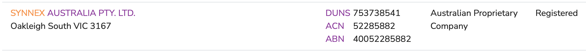

# Apple Business Manager Email Template

The process to register for Apple Business Manager is straight forward.

There is an [Apple Business Manager Getting Started Guide](https://www.apple.com/business/site/docs/Apple_Business_Manager_Getting_Started_Guide.pdf) pdf and [online documentation for ABM](https://support.apple.com/en-au/guide/apple-business-manager/axm402206497/web) to guide you through the process.

 
Essentially you just go to [https://business.apple.com](https://business.apple.com), select **Sign up now** and follow the process.  
 
You will need to know you DUNS which you can look up at [Illion Express](https://express.illion.com.au/)

 
The result I got for your organisation was:

When you sign up you will need to provide an email address that’s associated with your business. Consumer email addresses from services such as Gmail or Yahoo Mail won’t be accepted. The email can not already be used as a Personal Apple Account. The account associated with this email address becomes the initial administrator for Apple Business Manager. This will also be the address that Apple uses should there ever be a need for support. Consider using an email address that can be accessed by other staff at your organisation e.g. a shared mailbox

There will be a verification process so you will need to nominate someone in your organisation who can accept the terms of Apple Business Manager on behalf of the company.

Once you have completed the signup you will need to ask your supplier for a Reseller ID and supply them with your Organisation ID from within Apple Business Manager so that future device purchases will be automatically populated.

 

