<!--
# Table of Contents

[Introduction and Prerequisites](#Introduction%20and%20Prerequisites)

[iOS Configuration Profiles](#iOS%20Configuration%20Profiles)

[iOS App Deployment](#iOS%20App%20Deployment)

[iOS Device Assignment an d Enrollment Test](#iOS%20Device%20Assignment)

[Mac Configuration Profiles](#Mac%20Configuration%20Profiles)

[Mac App Deployment](#Mac%20App%20Deployment)

[Mac Additional Setup](#Mac%20Additional%20Setup)

[Mac Device Assignment and Enrollment Test](#Mac%20Device%20Assignment)

[Mac Operations](#Mac%20Operations)

[Additional Mac Config Profiles](#Additional%20Mac%20Config%20Profiles)

[Resources](#Resources)

***
-->

# Introduction and Prerequisites

The following pages give high level level directions for setting up Intune with basic Mac management capabilities.

It is assumed that you are already familiar with Intune and have existing Intune and Apple Business Manager instances set up and have logins with sufficient privilege to carry out the operations required.

In Apple Business Manager a managed Apple ID with either the Administrator or Device Enrollment Manager role is required to add an MDM. To add a Location and assign the content Manager Role the Administrator or People Manager role is required.

In Intune sign in as a member of the *Global Administrator* or *Intune Service Administrator* Entra ID roles

***
<div style="page-break-after: always"></div>

# Intune Setup

This section describes the essential setup information that links Intune to the various Apple Services needed to achieve Automated Device enrollment and ongoing device management

## APNS Certificate

*Apple Push Notification Services are critical to the operation of MDM. For any action the MDM needs to take such as issuing a command or installing a profile the initial communication with the device is via APNS.*

To access the Intune UI, in a browser open [https://intune.microsoft.com/](https://endpoint.microsoft.com/) and log in with a **Entra ID** user ID that has the role of *Global Administrator* or *Intune Service Administrator* for your tenancy

Navigate to **Devices -> macOS -> macOS Enrollment**

Click **Apple MDM Push Certificate**

Check the box granting permission to send information to Apple

Click on **Download your CSR**

In a new browser window or tab open [https://identity.apple.com/pushcert/](https://identity.apple.com/pushcert/) and log in with a managed Apple ID.

*Do not use a personal Apple ID for this process as management the APNS certificate will be critical over the life of your device management solution and access via a personal Apple ID may become unavailable as staff change over time. Using a Managed Apple ID keeps control within the Apple Business Manager (or Apple School Manager) instance.*


Click **Create a Certificate**

Upload the CSR, create and download the certificate

You can log out and close this window/tab


Return to the **Intune UI**

Under **Apple ID** Enter the Managed Apple ID you used to log in and create the certificate

Under **Apple MDM push certificate** Select the certificate you just downloaded then click **Upload**

The Microsoft Documentation for this procedure is at [https://learn.microsoft.com/en-us/mem/intune/enrollment/apple-mdm-push-certificate-get](https://learn.microsoft.com/en-us/mem/intune/enrollment/apple-mdm-push-certificate-get)

## Automated Device Enrollment Token

*The Device Enrollment token enables secure communication between Apple Business Manager or Apple School Manager and the MDM to allow for Automated Device Enrollment.*

In the **Intune UI**

Navigate to **Devices -> iOS/iPadOS -> iOS/iPadOS Enrollment**

(Devices -> macOS -> macOS Enrollment will also work)

Click **Enrollment program tokens**

Click on **+ Add** to add a new token

Check the box granting permission to send information to Apple

Click on **Download your public key**


To access Apple Business Manager open a new browser window or tab and navigate to [https://business.apple.com](https://business.apple.com) and log in with a Managed Apple ID that has the role of Administrator or Device Enrolment Manager

Click your name at the bottom of the sidebar, and click **Preferences**

Under **Your MDM Servers** click the plus sign to **+ Add**

Name your MDM server and upload the **Public Key**

Download the Server Token by clicking on **Download Token** then clicking **Download Server Token**


In the **Intune UI**

Under **Apple ID** enter the Managed Apple ID you used to log in and  
create the Server Token

Under **Apple token** select the Server Token just downloaded then click **Next** then click **Create**

The Microsoft Documentation for this procedure is at  
[https://learn.microsoft.com/en-us/mem/intune/enrollment/device-enrollment-program-enroll-ios](https://learn.microsoft.com/en-us/mem/intune/enrollment/device-enrollment-program-enroll-ios)

## Apps and Books Token

*The Apps and Books Token (previously known as the Volume Purchase Program or VPP token) enables secure communication between Apple Business Manager or Apple School Manager and the MDM for the management of Apps and Book licensing*

In **Apple Business Manager**

In the sidebar click **Locations**

Click the plus sign to **+ Add**

Enter the details and create the new location

Click your name at the bottom of the sidebar, and click **Preferences**

Click **Payments and Billing**

Find the location you just created under **Server Tokens** and download the VPP token by clicking **Download**


In the **Intune UI**

Navigate to **Tenant administration -> Connectors and tokens -> Apple VPP Tokens**

Click **+ Create** to Create VPP Token

Under **Token Name** give the Token the same name used in ABM

Enter the Managed Apple ID used to create the VPP token in ABM

Upload the token file and click **Next**

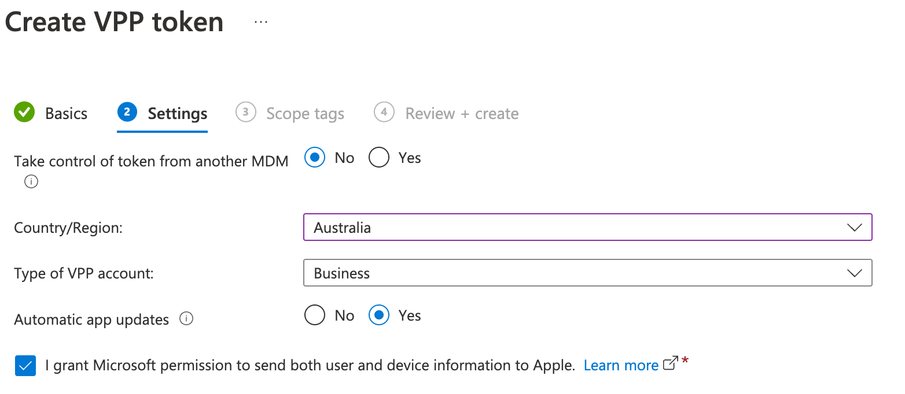


Click through to complete the process.

You can ignore the Scope Tags page for this exercise

The Microsoft Documentation for this procedure is at  
[https://learn.microsoft.com/en-us/mem/intune/apps/vpp-apps-ios](https://learn.microsoft.com/en-us/mem/intune/apps/vpp-apps-ios#upload-an-apple-vpp-or-apple-business-manager-location-token)

***
<div style="page-break-after: always"></div>

# iOS / iPadOS

## iOS Device Enrollment Profile

*The Device Enrollment Profile is created by the MDM and synchronised with Apple Business Manager or Apple School Manager to enable the Automated Device Enrolment process. A Device Enrollment Profile is created and assigned to one or more devices. Upon activation that profile will be installed on the device which will provide certificates and the URL of the MDM that will manage the device. A list of Setup Assistant items to hide from the user is also provided.*

### Purchase Company Portal licenses

In **Apple Business Manager**

In the sidebar click **Apps and Books**

Search for **Microsoft Intune Company Portal** and select it.

Under **Buy Licenses** select the location corresponding to your Intune instance and specify 2 in the quantity then click **Get**

***NOTE:*** *Company Portal is Deployed automatically as part of AutomatedDevice Enrolment. It is a pre requisite that VPP licenses are available for this to work but it is currently not necessary to separately scope the app to the required devices. This will change in future.*


In the **Intune UI**

Ensure the app appears in the list under Apps -> iOS/iPadOS apps


**NOTE:** *It may be necessary to force synchronisation after the ABM app purchase* 


In the **Intune UI**

Navigate to **Tenant administration -> Connectors and tokens -> Apple VPP Tokens**

Right click on the token name and select  **Sync**

Navigate to **Devices -> iOS/iPadOS -> iOS/iPadOS Enrollment**

Click **Enrollment program tokens**

Click the token you created from the list

Under Manage click **Profiles**

Click **+ Create Profile -> iOS/iPadOS**

Complete the config as follows:

Name the profile e.g. `iOS ADE with MFA` then click **Next**

Settings should be as follows:

User affinity = `Enroll with User Affinity`

Authentication Method = `Setup Assistant with modern authentication`

Locked Enrollment = `Yes`

Await Final Configuration = `Yes`

Other settings can be default

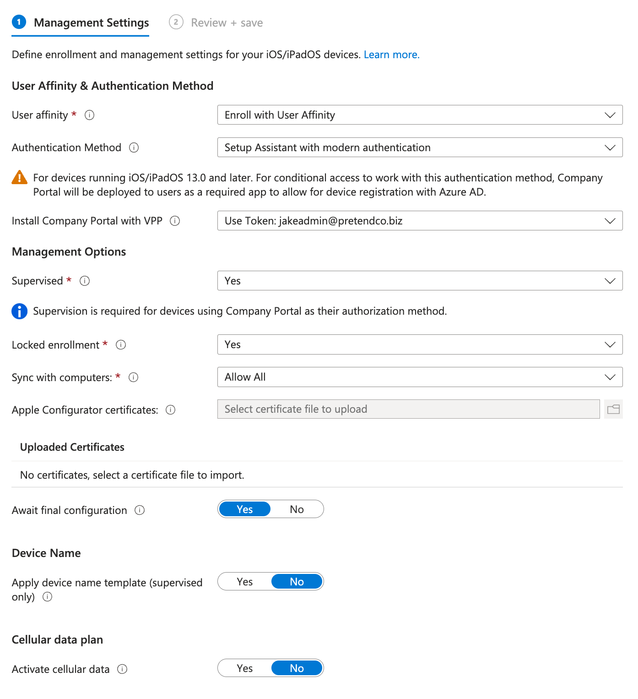

Enter a department Name and Phone Number and toggle all setup assistant screens to Hide except

Passcode = `Show`

Location Services = `Show`

Touch ID and Face ID = `Show`

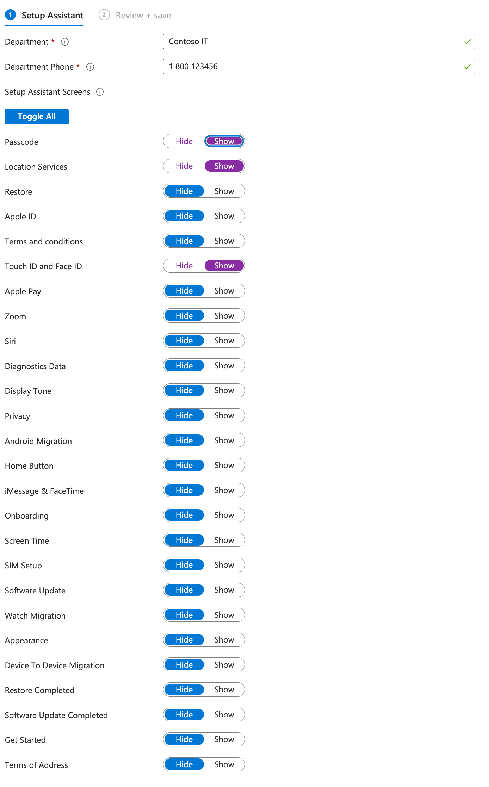


Save the enrolment profile

Click **Set default profile** and set the just created profile as the default for iOS/iPadOS

***

# iOS Configuration Profiles

*Create a few essential configuration profiles. The method is the same in each case with one possible key difference. Use of a Template or the Setting catalogue.*

## Passcode Compliance Policy

*Setting a Compliance Policy creates a configuration profile and also implements a corresponding compliance check in Intune. This policy is used to ensure a device passcode is set with appropriate complexity.*

[https://learn.microsoft.com/en-us/mem/intune/protect/compliance-policy-create-ios](https://learn.microsoft.com/en-us/mem/intune/protect/compliance-policy-create-ios)


In the **Intune UI**

Navigate to **Devices -> iOS/iPadOS -> Compliance Policies**

Click **+ Create** to Create a new policy then Create a Policy **Create**

Give the policy a name e.g. `Passcode` then click **Next**

Under **System Security**

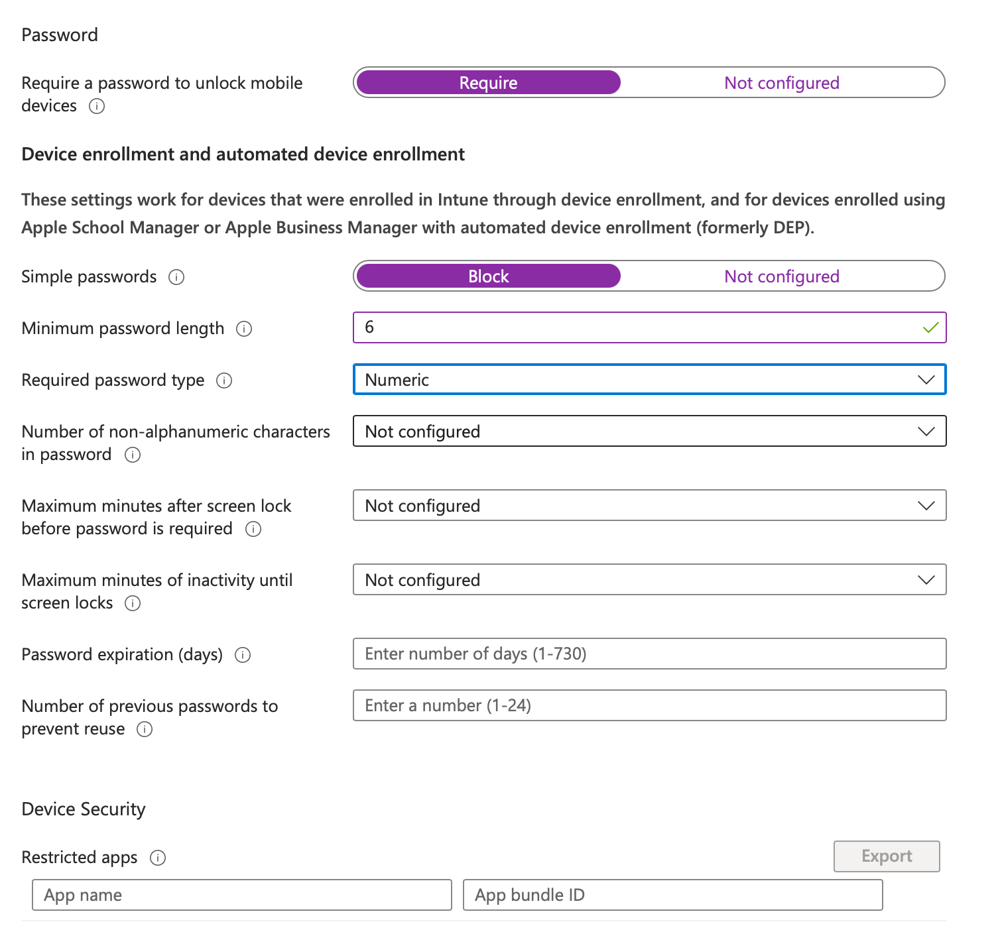


Click **+ Add all devices**

Click **Next**

Click **Create**

***

## Managed Open In Profile

*The Managed Open profile is used to implement the Managed Open In controls on iOS and iPadOS that limit the flow of data between managed and unmanaged apps.*

In the **Intune UI**

Navigate to **Devices -> iOS/iPadOS -> Configuration Profiles**

Click **+ Create profile** to Create a new profile

Click **Profile Type - Settings Catalogue** then **Create**

Give the profile a name e.g. `Managed Open In` then click **Next**

Click **+ Add settings** and choose **Restrictions** and select the settings in the screenshot below and close the **Settings Picker**

Set the values to True or False as shown

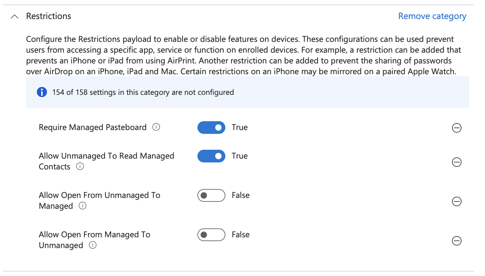

Click **Next** then on Scope Tags click **Next**

In Assignments Click **+ Add all devices**

Click **Next** then Click **Create**

***

## Single Sign On Profile

*The Single Sign On profile enables the use of Apple's Extensible Single Sign On framework in conjunction with the Entra ID SSO Extension to reduce the burden on users logging in while maintained strong authentication and authorisation using modern authentication protocols. This also requires that Microsoft Authenticator is installed on the device.*


*In the **Intune UI**

Navigate to **Devices -> iOS/iPadOS -> Configuration Profiles**

Click **+ Create profile** to Create a new profile

Click **Profile Type - Settings Catalogue** then **Create**

Give the profile a name e.g. `Entra ID SSO` then click Next

Click **+ Add settings** and choose **Authentication -> Extensible Single Sign On (SSO)** and select the settings in the screenshot below and close the Settings Picker

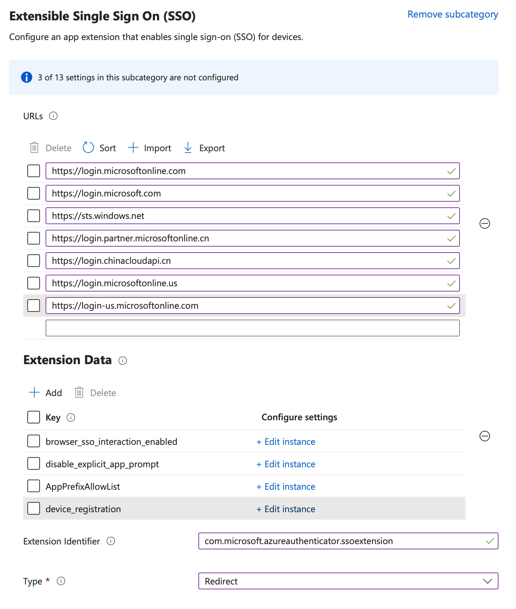

| Key                             | Type    | Value                     |
| ------------------------------- | ------- | ------------------------- |
| browser_sso_interaction_enabled | Integer | 1                         |
| disable_explicit_app_prompt     | Integer | 1                         |
| AppPrefixAllowList              | String  | com.microsoft.,com.apple. |
| device_registration             | String  | {{DEVICEREGISTRATION}}    |

Click **Next** then on Scope Tags click **Next**

In Assignments Click **+ Add all devices**

Click **Next** then Click **Create**

***

## Email Profile

*The Email profile will add an account the the native iOS Mail app on behalf of the user.*

In the **Intune UI**

Navigate to **Devices -> iOS/iPadOS -> Configuration Profiles**

Click **+ Create profile** to Create a new profile

Click **Profile Type - Templates** then **Email** then **Create**

Give the profile a name e.g. `Exchange` Online then click **Next**

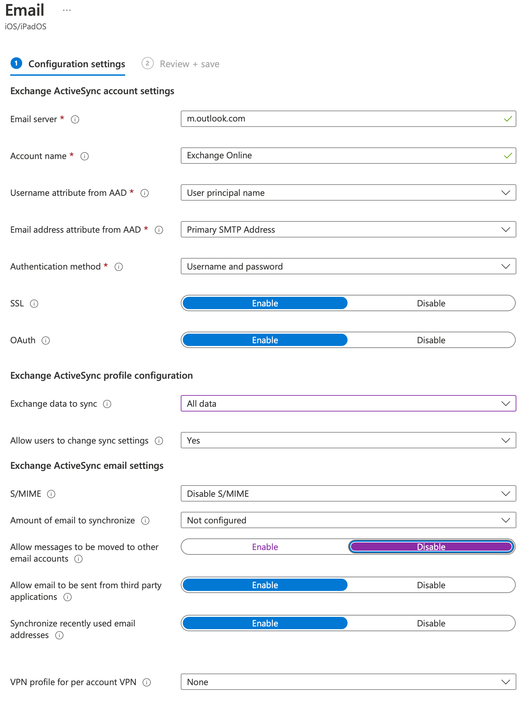


Click **+ Add all devices**

Click **Next**

Click **Create**

***

# iOS App Deployment

## VPP

### Deploy Microsoft Authenticator

In **Apple Business Manager**

In the sidebar click **Apps and Books**

Search for **Microsoft Authenticato**r and select the iOS version

Under Buy Licenses select the location corresponding to your Intune instance and specify 10 in the quantity then click **Get**

**In the Intune UI**

Navigate to **Apps -> iOS/iPadOS**

Select **Microsoft Authenticator** from the list of available apps. If it is not listed try clicking Refresh

Click on **Properties**

Click on Assignments **Edit** and assign the app under Required -> **+ Add all devices** then **Review + save**

### Deploy Additional Apps

Repeat the above process to deploy additional apps such as Microsoft Teams and OneDrive and Workday

You can make apps appear as optional installs within the Company Portal  
pp by assigning them as Available for enrolled devices rather than Required

***NOTE: It may be necessary to force synchronisation after the ABM app purchase*** 


**In the Intune UI**

Navigate to **Tenant administration -> Connectors and tokens -> Apple VPP Tokens**

Right click on the token name and select **Sync**

***

# App Configuration

*These settings are app specific and control, behaviour of the specific apps as determined by the app developer. The example below sets the UPN used by Teams based on the user that enrolled the device*

## Teams

In the Intune UI

**Apps -> App Configuration Policies**

Click **+ Add -> Managed Devices**

Give the policy a name e.g. `Teams UPN`

Select Platform **iOS/iPadOS**

Targeted App -> Select **Microsoft Teams**

Click **Next**

Configuration settings format -> select **Use configuration designer**

Enter values as follows:

| Key                          | Type   | Value                 |
| ---------------------------- | ------ | --------------------- |
| IntuneMAMAllowedAccountsOnly | String | Enabled               |
| IntuneMAMUPN                 | String | {{userprincipalname}} |


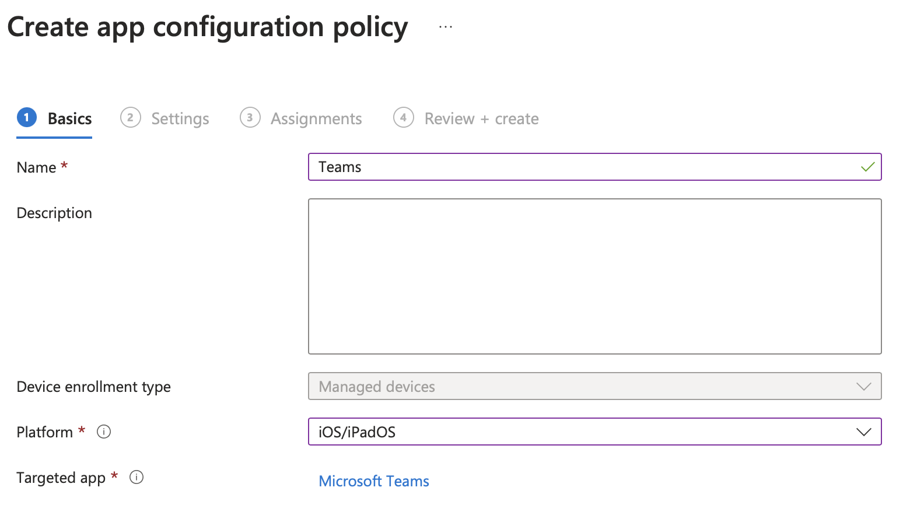

Set Scope to All devices

Click **Next**

Click **Create**

***

# iOS Device Assignment

In **Apple Business Manager**

From the sidebar click Devices

Search for the serial number of the iPhone you will enrol and select it

Click **Edit MDM Server**

Click **Assign the Following MDM** and choose the appropriate MDM from the drop down list then click Continue


**In the Intune UI**

Navigate to **Devices -> iOS/iPadOS -> iOS/iPadOS Enrollment**

Click **Enrollment program tokens**

Select the token you created from the list

Under Manage click **Devices**

If the device you assigned from ABM is not listed click Sync, wait a minute and click Refresh

Check the box next to the device(s) in the list that you wish to apply an ADE profile then click **Assign Profile**

Under Assign Profile select the appropriate enrolment profile from the drop down list

Click **Sync** to sync with ABM. This can be done only after 15 mins or more from the last manual sync.

## Enrolment Test

You can now test the enrolment process on the iPhone you have assigned

***

# macOS

## Mac Device Enrollment Profile

*The Device Enrollment Profile is created by the MDM and synchronised with Apple Business Manager or Apple School Manager to enable the Automated Device Enrolment process. A Device Enrollment Profile is created and assigned to one or more devices. Upon activation that profile will be installed on the device which will provide certificates and the URL of the MDM that will manage the device. A list of Setup Assistant items to hide from the user is also provided.*


In the **Intune UI**

Navigate to **Devices -> macOS -> macOS Enrollment**

Click **Enrollment program tokens**

Click the token you created from the list

Under Manage click **Profiles**

Click **+ Create Profile -> macOS**

Complete the config as follows:

Name the profile e.g. `macOS ADE with MFA`

User affinity = `Enroll with User Affinity`

Authentication Method = `Setup Assistant with modern authentication`

Locked Enrollment = `Yes`

Enter a department Name and Phone Number and toggle all setup assistant  
screens to Hide except

Location Services = `Show`

Touch ID and Face ID = `Show`

Configure Account Settings

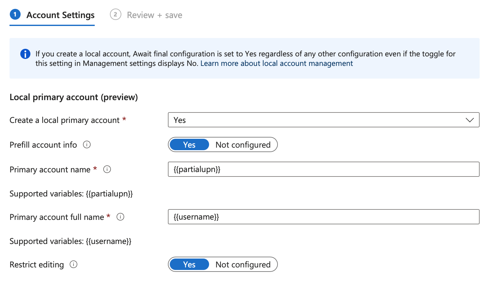


Click **Create**

Click **Set default profile** and set the just created profile as the default for macOS

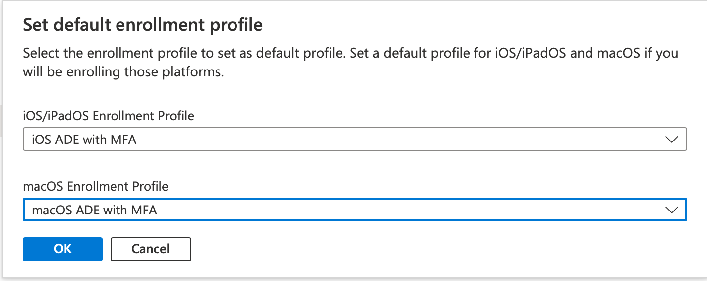


***

# Mac Configuration Profiles

Create a few essential configuration profiles. The method is the same in each case with one possible key difference. Use of a Template of the Setting catalogue. An example of each is given.

For configuration profiles created using the Settings Catalogue there is an Export JSON capability. There is a corresponding capability to select Import Policy as an option when creating a new configuration profile so previous configs can be reused.


## FileVault Profile

*This profile enables FileVault full disk encryption.*


In the **Intune UI**

Navigate to **Devices -> macOS -> Configuration Profiles**

Click **+ Create** to Create a new profile

Click **Profile Type - Settings Catalogue** then **Create**

Give the profile a name e.g. `FileVault` then click **Next**

Click **+ Add settings** and choose **Full Disk Encryption** and select the settings in the screenshot below and close the Settings Picker.

Make the selections as shown

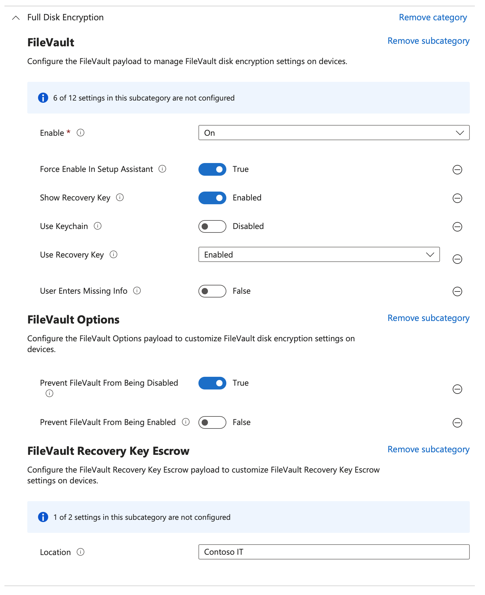

Click **Next** then on Scope Tags click **Next**

In Assignments Click **+ Add all devices**

Click **Next** then Click **Create**

***

## Firewall Profile

*This profile enables the built in macOS Application Firewall*


In the **Intune UI**

Navigate to **Devices -> macOS -> Configuration Profiles**

Click + **Create** to Create a new profile

Click **Profile Type - Settings Catalogue** then **Create**

Give the profile a name e.g. Firewall then click **Next**

Click **+ Add settings** and choose **Networking -> Firewall** and select the settings in the screenshot below and close the **Settings Picker**

Make the selections as shown

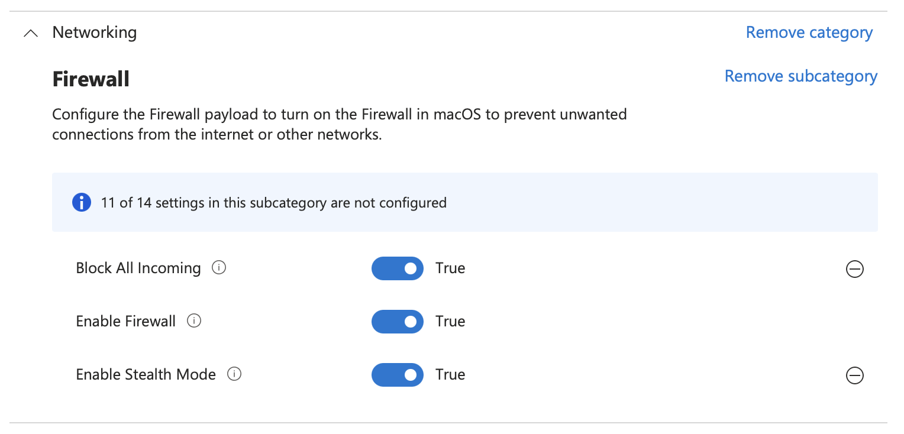


Click **Next** then on Scope Tags click **Next**

In Assignments Click **+ Add all devices**

Click **Next** then **** Click **Create**

***

## Gatekeeper Profile

*This profile enables Gatekeeper to ensure only trusted apps can launch**on macOS*

In the **Intune UI**

Navigate to **Devices -> macOS -> Configuration Profiles**

Click **+ Create** to Create a new profile

Click **Profile Type - Settings Catalogue** then **Create**

Give the profile a name e.g. Gatekeeper then click **Next**

Click **+ Add settings** and choose setting from **App Store, System Policy** and select the settings in the screenshot below and close the **Settings Picker**

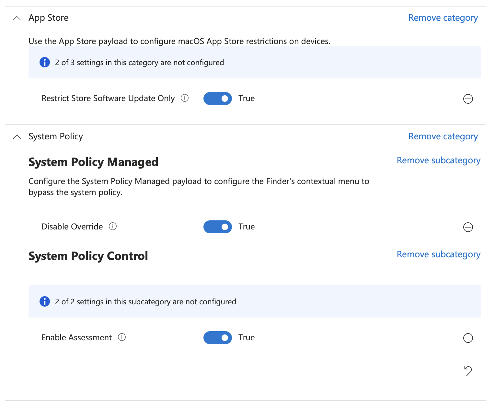

Click **Next** then on Scope Tags click **Next**

In Assignments Click **+ Add all devices**

Click **Next** then Click **Create**

***

## Extensible SSO Profile

*The Single Sign On profile enables the use of Apple's Extensible Single Sign On framework in conjunction with the Entra ID SSO Extension to reduce the burden on users logging in while maintained strong authentication and authorisation using modern authentication protocols. This also requires that Company Portal is installed on the device.*


In the **Intune UI**

Navigate to **Devices -> macOS -> Configuration Profiles**

Click **+ Create** to Create a new profile

Click **Profile Type - Settings Catalogue** then **Create**

Give the profile a name e.g. Entra ID SSO then click **Next**

Click **+ Add settings** and choose **Authentication -> Extensible Single Sign On (SSO)** and select the settings in the screenshot below and close the **Settings Picker**

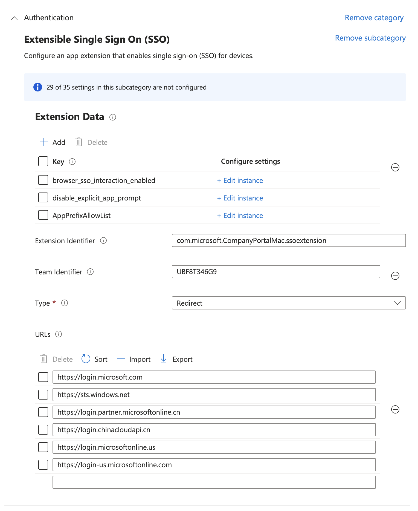


| Key                             | Type    | Value                     |
| ------------------------------- | ------- | ------------------------- |
| browser_sso_interaction_enabled | Integer | 1                         |
| disable_explicit_app_prompt     | Integer | 1                         |
| AppPrefixAllowList              | String  | com.microsoft.,com.apple. |

Click **Next** then on Scope Tags click **Next**

In Assignments Click **+ Add all devices**

Click **Next** then Click **Create**

***

## Office 365 Profile

*This sets some parameters for Office 365 including the default user for**licensing*


In the **Intune UI**

Navigate to **Devices -> macOS -> Configuration Profiles**

Click **+ Create** to Create a new profile

Click **Profile Type - Settings Catalogue** then **Create**

Give the profile a name e.g. Office 365 Parameters then click **Next**

Click **+ Add settings** and choose **Microsoft Office -> Microsoft Office** then click the **Enable Automatic sign-in** and **Office Activation Email Address** checkboxes and close the **Settings Picker**

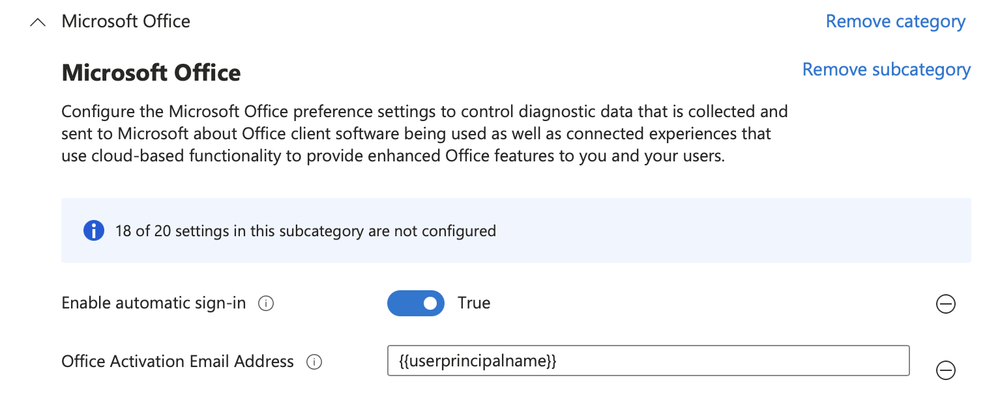

Under **Assignments** click **+Add all devices**

***

## Custom Profile

*This profile sets the configuration of the Support App which we will install as part of this setup.*

Create a custom config for the Support app as per the documentation on the developers web site

This can be done with a text editor or a tool like [iMazing Profile editor](https://imazing.com/profile-editor).

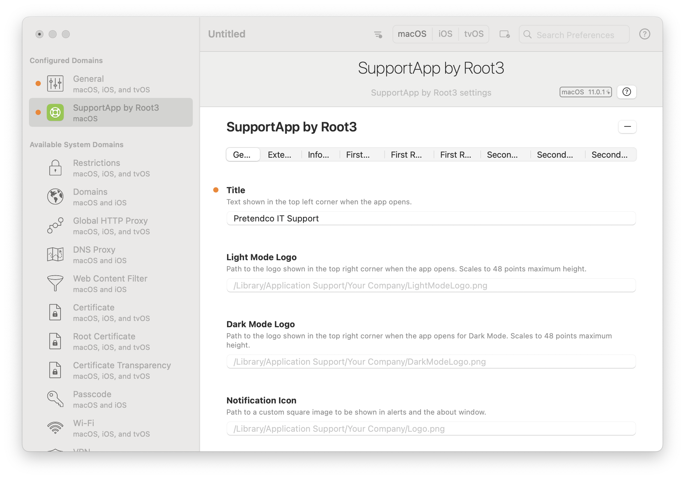

In the **Intune UI**

Navigate to **Devices -> macOS -> Configuration Profiles**

Click + **Create** to Create a new profile

Click **Profile Type -> Templates** then **Custom** then **Create**

Give the profile a name e.g. Support App Config then click **Next**

For **Custom configuration profile name enter** Support App Config

Set **Deployment Channel** to **Device Channel**

Upload the Custom Configuration profile file. Use filename `Suppport_Intune.mobileconfig`

Under **Assignments** click **+Add all devices**

***

## Managed Login Items Profile

*Any background items that run upon a device boot or at user login including Launch Daemons, Launch Agents and Open at Login Apps can be deactivated by an Admin user. In order to prevent these items being deactivated a Managed Login Items config profile is deployed.*

In the **Intune UI**

Navigate to **Devices -> macOS -> Configuration Profiles**

Click **+ Create** to Create a new profile

Click **Profile Type - Settings Catalogue** then **Create**

Give the profile a name e.g. Background and Login Items then click **Next**

Click **+ Add settings** and choose **Login -> Service Management - Managed Login Items** then check all but **Team Identifier** and close the **Settings Picker**

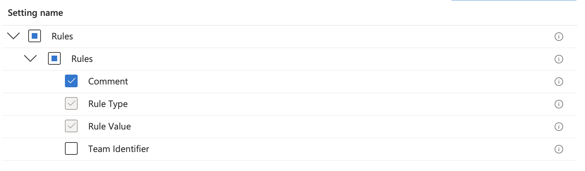

Enter the following values: 

| Comment           | Rule Type                | Rule Value       | Team Identifier |
| ----------------- | ------------------------ | ---------------- | --------------- |
| Microsoft Apps    | Bundle Identifier Prefix | com.microsoft    | Not Configured  |
| Microsoft Daemons | Label Prefix             | com.microsoft    | Not Configured  |
| Support App       | Label                    | nl.root3.support | Not Configured  |

Under **Assignments** click **+Add all devices**

***

# Mac App Deployment

## Scripting

### Deploy Company Portal

*Company Portal is required for a number of functions. These include device registration with Azure AD, a self Service App catalogue and provision of the Azure AD SSO Extension code.*

In a new browser window or tab open [https://github.com/microsoft/shell-intune samples/blob/master/macOS/Apps/Company%20Portal/installCompanyPortal.zsh](https://github.com/microsoft/shell-intune%20samples/blob/master/macOS/Apps/Company%2520Portal/installCompanyPortal.zsh)

Copy the contents of the zsh script, paste in to a text editor and save the file as `InstallCompanyPortal.zsh`


In the **Intune UI**

Navigate to **Devices -> macOS -> Shell Scripts**

Click **+ Add**

Name the Script e.g. Install Company Portal and click **Next**

Upload the saved `InstallCompanyPortal.zsh` file and set the parameters as 

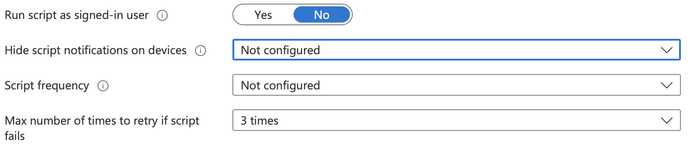

Under **Assignments** click **+Add all devices**

***

## Line of Business / Packaged

### Deploy Microsoft Office

In the **Intune UI**

Navigate to **Apps -> macOS**

Click **+Add**

From the **App type** drop down list select **Microsoft 365 Apps / macOS**

Under **Assignments** click **+Add all devices** under **REQUIRED**

***

### Deploy Support App

*The Support App helps an the end user get quick access to basic device information and apps needed when receiving support from IT.*

*This package has been created and signed by the developer so can be uploaded and deployed by Intune.*

*Intune supports two methods to deploy .pkg files. In this example we will use the Line-of-business method that leverages the MDM command InstallEnterpriseApplication.*

Download the latest packaged version of the Support app from [https://github.com/root3nl/SupportApp/releaseshttps://github.com/root3nl/SupportApp/releases](https://github.com/root3nl/SupportApp/releases)


In the **Intune UI**

**Apps -> macOS**

Click **+ Add**

From the drop down menu select **Other -> Line-of-business app**

Upload the Support App package file `Support.x.x.pkg`

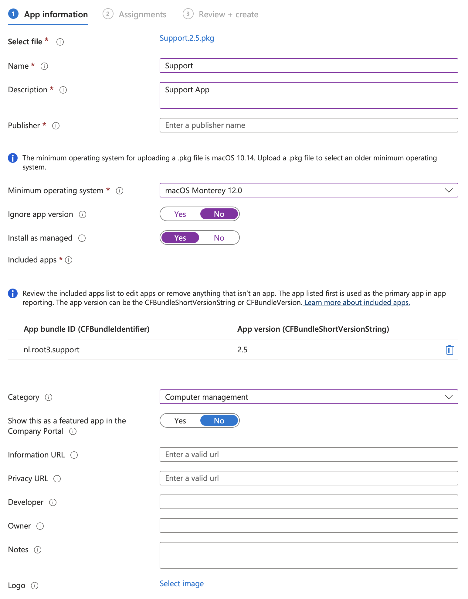

Under **Assignments** click **+Add all devices**

***

### Deploy Privileges App

*The SAP privileges App helps an Admin user manage their risk by allowing them to demote themselves to a Standard user when having Admin privileges is not required*

Download the latest version of the SAP Privileges tool from [https://github.com/SAP/macOS-enterprise-privileges](https://github.com/SAP/macOS-enterprise-privileges)

On a Mac install Privileges in the Applications folder

Use the [Packages App](http://s.sudre.free.fr/Software/Packages/about.html) to create a file called `Privileges.pkg`


In the **Intune UI**

**Apps -> macOS**

Click **+Add**

From the drop down menu select **macOS app (PKG)**

Upload the .pkg file

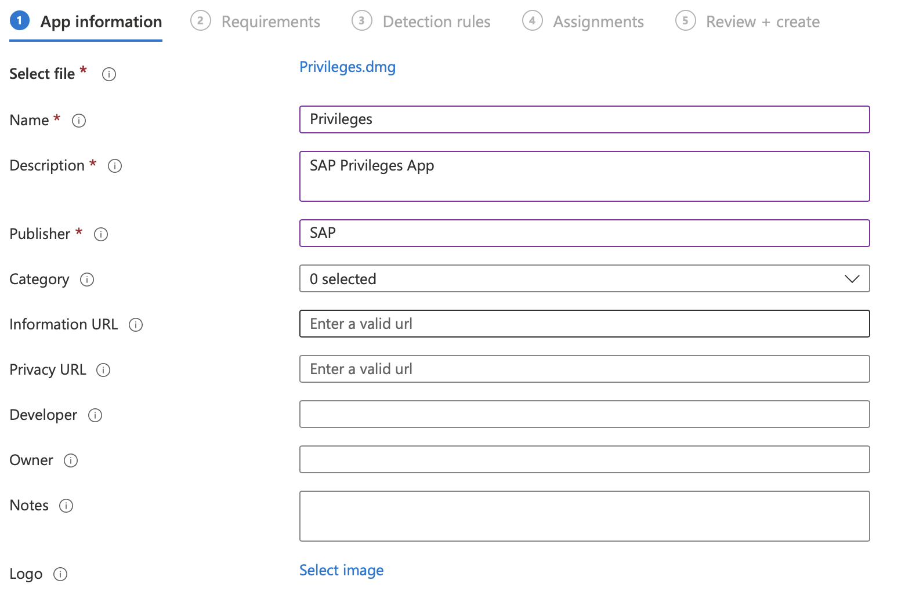


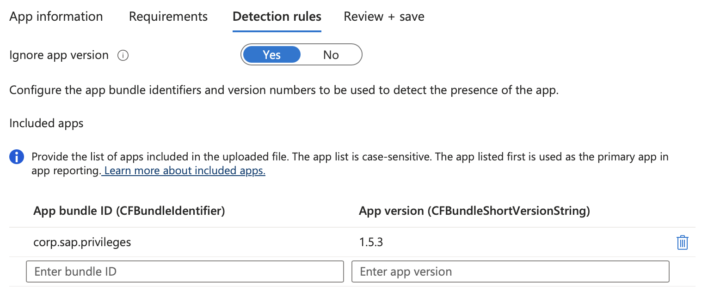

Under **Assignments** click **+Add all devices**

***

## VPP

### Deploy Slack

In **Apple Business Manager**

In the sidebar click **Apps and Books**

Search for **Slack for Desktop** and select the macOS version

Under Buy Licenses select the location corresponding to your Intune instance and specify 10 in the quantity then click **Get**

In the **Intune UI**

**Apps -> macOS**

Select **Slack for Desktop** from the list of available apps. If it is not listed try clicking **Refresh**

Under **Properties -> Assignments** click **Edit** and click **+Add all devices**

***

# Mac Additional Setup

## Set Mac Wallpaper (Optional)

*In order to use a custom image as the Mac Wallpaper the image file needs to be installed on the device. There are multiple methods to then set this image as the Wallpaper. This example uses a custom package to install the images and run a post install script to set the Wallpaper.*

Create the .pkg file using a tool such as [Packages from Whitebox](http://s.sudre.free.fr/Software/Packages/about.html). Include a post install script with the following content:

```shell
#!/bin/zsh
osascript -e 'tell application "Finder" to set desktop picture to POSIX file "/usr/local/wallpaper/Pretendco_Demokit_Dark.png"'
```


In the **Intune UI**

**Apps -> macOS**

Click **+ Add**

From the drop down menu select **Other -> macOS App (PKG)**

*The user would normally be prompted to approve the MDM Agent setting the Wallpaper so we deploy a PPPC Profile. This can be created using the [Jamf PPPC Utility](https://github.com/jamf/PPPC-Utility) as follows. Save the profile as `IntunePPPC.mobileconfig`

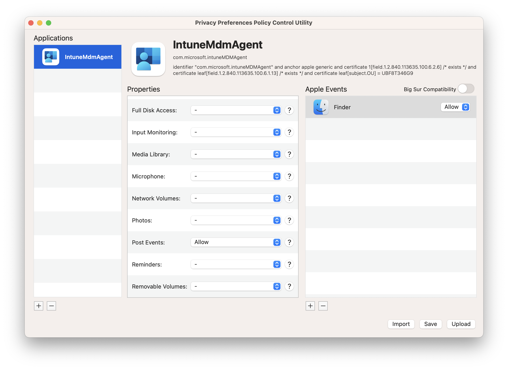


In the **Intune UI**

Navigate to **Devices -> macOS -> Configuration Profiles**

Click **+ Create** to Create a new profile

Click **Profile Type -> Templates** then **Custom** then **Create**

Give the profile a name e.g. `Intune Agent PPPC` then click **Next**

For **Custom configuration profile name** enter `Intune to Finder PPPC`

Set **Deployment Channel** to **Device Channel**

Upload the Custom Configuration profile file. Use filename `IntunePPPC.mobileconfig`

Under **Assignments** click **+Add all devices**

***

# Compliance Policies

## Disk Encryption Policy

*Intune can implement Compliance Policies which are evaluated as true or*false. This calculated state can be used by Azure AD Conditional Access polices to determine whether a user can access certain cloud based**resources from the device.*

In the Intune UI

Navigate to **Devices -> macOS -> Compliance policies**

Click **+ Create policy** to Create a new policy

Give the profile a name e.g. `Basic Compliance` then click **Next**

Set the following:

**Device Health -> Require System Integrity Protection** to `Require`

**System Security -> Device Security -> Firewall** to `Enable`

**System Security -> Device Security -> Incoming Connections** to `Block`

**System Security -> Device Security -> Stealth Mode** to `Enable`

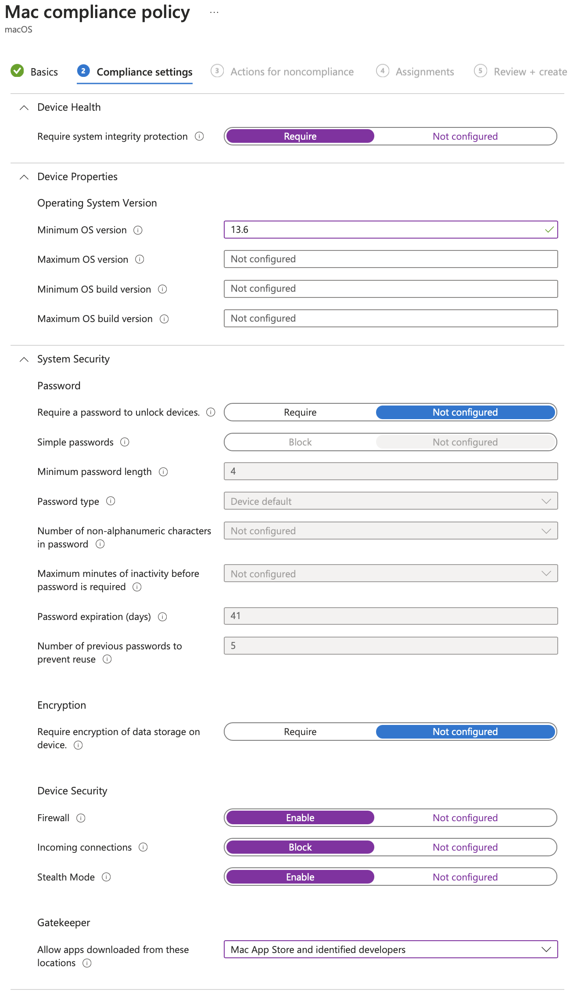

Set the **Action** to **Mark device noncompliant** and the **Schedule** to **Immediately**

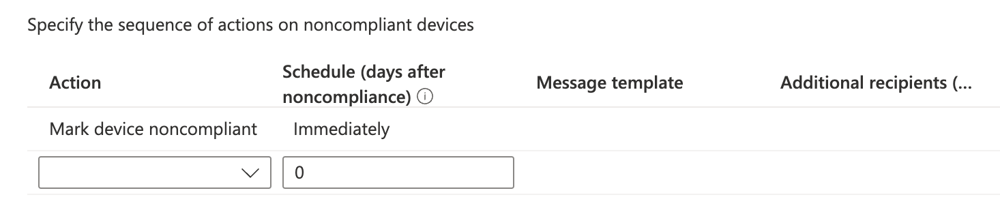

Under Assignments click **+Add all devices**

***

# Mac Device Assignment

In **Apple Business Manager**

From the sidebar click **Devices**

Search for the serial number of the Mac you will enrol and select it

Click **Edit MDM Server**

Click **Assign the Following MDM** and choose the appropriate MDM from the drop down list then click **Continue**

In the I**ntune UI**

Navigate to **Devices -> macOS -> macOS Enrollment**

Click **Enrollment program tokens**

Select the token you created from the list

Under Manage click **Devices**

If the device you assigned from ABM is not listed click **Sync**, wait a minute and click **Refresh**

Check the box next to the device(s) in the list that you wish to apply an ADE profile then click **Assign Profile**

Under Assign Profile select the appropriate enrolment profile from the drop down list

Click **Sync** to sync with ABM. This can be done only after 15 mins or more from the last manual sync.

## Enrolment Test

You can now test the enrolment process on the Mac you have assigned

Check profiles in the settings app.

Once Company Portal is installed launch it and log in. The device should appear non compliant.

Log out and back in again enabling FileVault in the process.

Log back into Company Portal and see the device is now compliant

Launch Apps, open [https://portal.office.com](https://portal.office.com) in Safari and add Exchange account to Mail.

***

# Mac Operations

## Software Updates

In the **Intune UI**

Navigate to **Devices -> macOS -> Update policies for macOS**

Click **+ Create** to Create a new profile

Give the profile a name then click **Next**

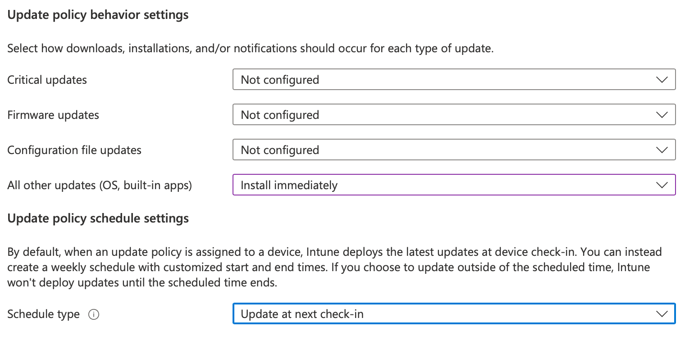

***

## DDM Software Updates

In the Intune UI

Navigate to Devices -> macOS -> Configuration Profiles

Click **+ Create** to Create a new profile

Click **Profile Type - Settings Catalogue** then **Create**

Give the profile a name e.g. `macOS Software Update` then click **Next**

Click **+ Add settings** and choose **Declarative Device Management (DDM) -> Software Update** then check Local Date and Time and Target OS Version and close the Settings Picker


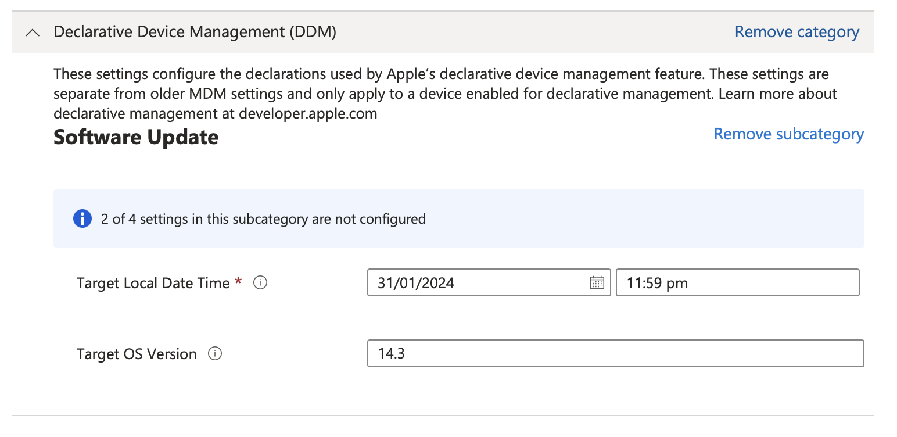

***

# FileVault Key Escrow

In the **Intune UI**

Navigate to **Devices -> macOS**

Select the relevant Mac from the list of devices

Click **Recovery Keys** then **Show Recovery Key**

## Erase All Content and Settings

In the **Intune UI**

Navigate to **Devices -> macOS**

Select the relevant Mac from the list of devices

Click **X Erase**

Enter any Recovery PIN then click **Erase**

***

# Additional Mac Config Profiles

*When you run the Mac Evaluation Utility on a Mac there is a category Mac Management -> Security with a number of items that are evaluated. The following profiles can help achieve a Success status for some of these items.*

## Disable the Guest Account

Navigate to **Devices -> macOS -> Configuration Profiles**

Click **+ Create** to Create a new profile

Click **Profile Type -> Settings Catalogue** then **Create**

Give the profile a name e.g. Disable Guest Account then click **Next**

Click **+ Add settings** and choose **Accounts -> Accounts -> Disable Guest Account**

Then set **Disable Guest Account** to **True**

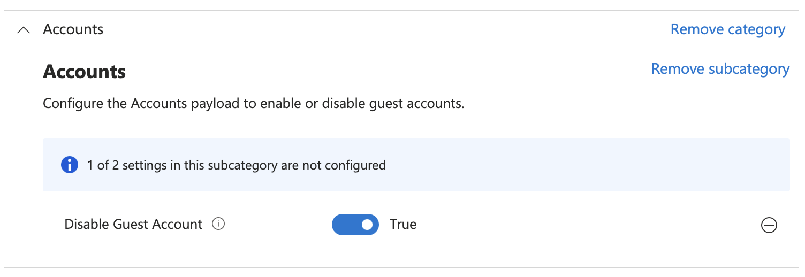

***

## Disable Auto-login

In the **Intune UI**

Navigate to **Devices -> macOS -> Configuration Profiles**

Click **+ Create** to Create a new profile

Click **Profile Type -> Templates** then **Custom** then **Create**

Give the profile a name e.g. Disable Auto Login then click **Next**

For **Custom configuration profile name enter Disable Auto Login**

Set **Deployment Channel** to **Device Channel**

Upload the Custom Configuration profile file

Assign to All Devices

```xml
<?xml version=”1.0” encoding=”UTF-8”?>
<!DOCTYPE plist PUBLIC “-//Apple//DTD PLIST 1.0//EN” “http://www.apple.com/DTDs/PropertyList-1.0.dtd”>
<plist version=”1.0”>
<dict>
    <key>PayloadContent</key>
    <array>
        <dict>
            <true/>
            <key>com.apple.login.mcx.DisableAutoLoginClient</key>
        </dict>
    </array>
    <key>PayloadDisplayName</key>
    <string>Login Window</string>
    <key>PayloadIdentifier</key>
    <string>com.example.myprofile</string>
    <key>PayloadType</key>
    <string>Configuration</string>
    <key>PayloadUUID</key>
    <string>61bd7d63-4a4a-4b67-9112-5ceb16afb4dc</string>
    <key>PayloadVersion</key>
    <integer>1</integer>
</dict>
</plist>
```

***

## Configure Screensaver Lock

Navigate to **Devices -> macOS -> Configuration Profiles**

Click **+ Create** to Create a new profile

Click **Profile Type -> Settings Catalogue** then **Create**

Give the profile a name e.g. Screensaver Lock then click **Next**

Click **+ Add settings** and choose **System Configuration -> Screensaver -> Select all these settings**

**Module Name =** 

**Login Window Module Path =** `/System/Library/`

**Login Window Idle Time =** *Preferred Value*

**Ask For Password Delay =** *Preferred Value*

**Ask For Password =** `True`

## Configure Passcode Profile

NOTE: Be sure to set this via the Settings Catalogue and not via a Template

Navigate to **Devices -> macOS -> Configuration Profiles**

Click **+ Create** to Create a new profile

Click **Profile Type -> Settings Catalogue** then **Create**

Give the profile a name e.g. Passcode Policy then click **Next**

Click **+ Add settings** and choose **Security -> Passcode ->** *Needed Settings based on company security policy*

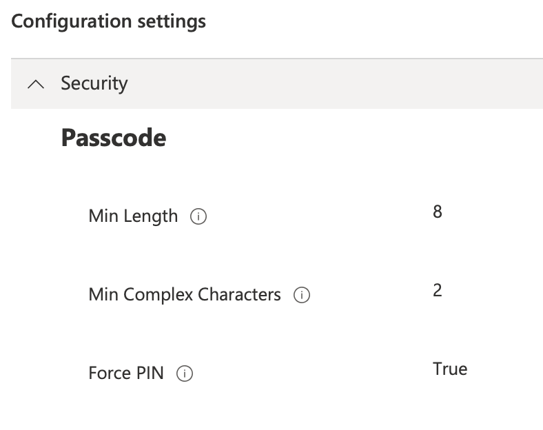

***

# Resources

## Setup

### APNS

[Get Apple MDM push certificate](https://learn.microsoft.com/en-us/mem/intune/enrollment/apple-mdm-push-certificate-get)

### Automated Device Enrolment

[Set up macOS enrollment](https://learn.microsoft.com/en-us/mem/intune/enrollment/macos-enroll)

### Configuration Profiles

[Microsoft Enterprise SSO plug-in for Apple devices](https://learn.microsoft.com/en-us/azure/active-directory/develop/apple-sso-plugin)

[macOS Configuration - See Settings for macOS](https://learn.microsoft.com/en-us/mem/intune/configuration/)

[Jamf PPPC Utility](https://github.com/jamf/PPPC-Utility/releases)

[iMazing Profile Editor](https://imazing.com/profile-editor)

### App Deployment

#### Apps and Books

[Volume-purchased iOS apps](https://learn.microsoft.com/en-us/mem/intune/apps/vpp-apps-ios)

#### Scripting

[Use shell scripts on macOS devices in Microsoft Intune](https://learn.microsoft.com/en-us/mem/intune/apps/macos-shell-scripts)

[Deploying macOS apps with the Microsoft Intune scripting agent](https://techcommunity.microsoft.com/t5/intune-customer-success/deploying-macos-apps-with-the-microsoft-intune-scripting-agent/ba-p/2298072)

[Sample shell scripts for macOS](https://github.com/microsoft/shell-intune-samples)

[Installomator](https://github.com/Installomator/Installomator)

#### Packaged Apps

[macOS LOB apps](https://learn.microsoft.com/en-us/mem/intune/apps/lob-apps-macos)

[AutoPkg](https://github.com/autopkg/autopkg)

[Munki - Software Management for OS X](https://www.munki.org/munki/)

[Comprehensive guide to managing macOS with Intune](https://oliverkieselbach.com/2021/07/14/comprehensive-guide-to-managing-macos-with-intune/) - A bit out of date but useful

[Packages App](http://s.sudre.free.fr/Software/Packages/about.html)

[Intune Uploader](https://github.com/almenscorner/intune-uploader)

### Operations

#### Software Update

[macOS update policies](https://learn.microsoft.com/en-us/mem/intune/protect/software-updates-macos)

#### Third Party Tools

[SAP Privileges App](https://github.com/SAP/macOS-enterprise-privileges)

[macOS Support App](https://github.com/root3nl/SupportApp)

[Outset](https://github.com/macadmins/outset/)

***
