<!-- title: Managing Apple Devices with Intune -->

Managing Apple Devices with Intune
==================================

[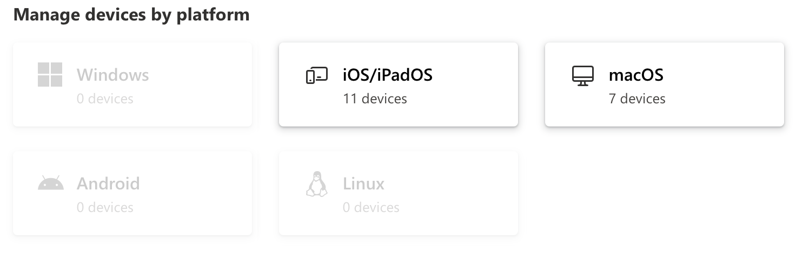](assets/OSList.png)

<!-- @import "[TOC]" {cmd="toc" depthFrom=1 depthTo=2 orderedList=false} -->

<!-- code_chunk_output -->

- [Introduction and Prerequisites](#introduction-and-prerequisites)
- [Intune Setup](#intune-setup)
  - [APNS Certificate](#apns-certificate)
  - [Automated Device Enrollment Token](#automated-device-enrollment-token)
  - [Apps and Books Token](#apps-and-books-token)
- [iOS / iPadOS](#ios--ipados)
  - [iOS Device Enrollment Profile](#ios-device-enrollment-profile)
- [iOS Configuration Profiles](#ios-configuration-profiles)
  - [Passcode Compliance Policy](#passcode-compliance-policy)
  - [Managed Open In Profile](#managed-open-in-profile)
  - [Single Sign On Profile](#single-sign-on-profile)
  - [Email Profile](#email-profile)
  - [Set Wallpaper](#set-wallpaper)
- [iOS App Deployment](#ios-app-deployment)
  - [VPP](#vpp)
- [iOS App Configuration](#ios-app-configuration)
  - [Teams](#teams)
- [iOS Device Assignment](#ios-device-assignment)
  - [Enrolment Test](#enrolment-test)
- [macOS](#macos)
  - [Mac Device Enrollment Profile](#mac-device-enrollment-profile)
- [Mac Configuration Profiles](#mac-configuration-profiles)
  - [FileVault Profile](#filevault-profile)
  - [Firewall Profile](#firewall-profile)
  - [Gatekeeper Profile](#gatekeeper-profile)
  - [Platform SSO Profile](#platform-sso-profile)
  - [Office 365 Profile](#office-365-profile)
  - [Custom Profiles](#custom-profiles)
  - [Managed Login Items Profile](#managed-login-items-profile)
- [Mac App Deployment](#mac-app-deployment)
  - [Apple App Store (VPP)](#apple-app-store-vpp)
  - [Line of Business / Packaged](#line-of-business--packaged)
  - [Built In Apps](#built-in-apps)
  - [Scripting](#scripting)
- [Mac Additional Setup](#mac-additional-setup)
  - [Set Mac Wallpaper (Optional)](#set-mac-wallpaper-optional)
- [Compliance Policies](#compliance-policies)
  - [Disk Encryption Policy](#disk-encryption-policy)
- [Mac Device Assignment](#mac-device-assignment)
  - [Enrolment Test](#enrolment-test-1)
- [Assignments / Scoping](#assignments--scoping)
  - [Using Assignment Filters](#using-assignment-filters)
- [Mac Operations](#mac-operations)
  - [Software Updates](#software-updates)
  - [DDM Software Updates](#ddm-software-updates)
  - [FileVault Key Escrow](#filevault-key-escrow)
  - [Erase All Content and Settings](#erase-all-content-and-settings)
- [Additional Mac Config Profiles](#additional-mac-config-profiles)
  - [Disable the Guest Account](#disable-the-guest-account)
  - [Disable Auto-login](#disable-auto-login)
  - [Configure Screensaver Lock](#configure-screensaver-lock)
  - [Configure Passcode Profile](#configure-passcode-profile)
- [Resources](#resources)
  - [Example Baseline Configuration Profile](#example-baseline-configuration-profile)
  - [Links to other resources](#links-to-other-resources)

<!-- /code_chunk_output -->

***
<div style="page-break-after: always"></div>

# Introduction and Prerequisites

The following pages give high level directions for setting up Intune with basic iOS / iPadOS and Mac management capabilities.

It is assumed that you are already familiar with Intune and have existing Intune and Apple Business Manager instances set up and have logins with sufficient privilege to carry out the operations required.

In Apple Business Manager a Managed Apple Account with either the *Administrator* or *Device Enrollment Manager* role is required to add an MDM. To add a Location and assign the Content the _Administrator_ or _People Manager_ role is required.

In Intune sign in as a member of the *Global Administrator* or *Intune Service Administrator* Entra ID roles

***
<div style="page-break-after: always"></div>

# Intune Setup

This section describes the essential setup information that links Intune to the various Apple Services needed to achieve Automated Device enrollment and ongoing device management

## APNS Certificate

_Apple Push Notification Services are critical to the operation of MDM. For any action the MDM needs to take such as issuing a command or installing a profile the initial communication with the device is via APNS._

<br>

To access the **Intune UI**, in a browser open [https://intune.microsoft.com/](https://intune.microsoft.com/) and log in as an **Entra ID** user that has the role of *Global Administrator* or *Intune Service Administrator* for your tenancy

In the **Intune UI**

Navigate to **Devices -> iOS/iPadOS -> Enrollment**

(**Devices -> macOS -> Enrollment** will also work)

Click **Apple MDM Push Certificate**

Check the box granting permission to send information to Apple

Click on **Download your CSR**

In a new browser window or tab open [https://identity.apple.com/pushcert/](https://identity.apple.com/pushcert/) and log in with a managed Apple Account.

*Do not use a personal Apple Account for this process as management the APNS certificate will be critical over the life of your device management solution and access via a personal Apple Account may become unavailable as staff change over time. Using a Managed Apple Account keeps control within the Apple Business Manager (or Apple School Manager) instance.*

Click **Create a Certificate**

Upload the CSR, create and download the certificate

You can log out and close this window/tab

Return to the **Intune UI**

Under **Apple Account** Enter the Managed Apple Account you used to log in and create the certificate

Under **Apple MDM push certificate** Select the certificate you just downloaded then click **Upload**

The Microsoft Documentation for this procedure is at [https://learn.microsoft.com/en-us/mem/intune/enrollment/apple-mdm-push-certificate-get](https://learn.microsoft.com/en-us/mem/intune/enrollment/apple-mdm-push-certificate-get)

## Automated Device Enrollment Token

*The Device Enrollment token enables secure communication between Apple Business Manager or Apple School Manager and the MDM to allow for Automated Device Enrollment.*

In the **Intune UI**

Navigate to **Devices -> iOS/iPadOS -> Enrollment**

Click **Enrollment program tokens**

Click on **+ Create** to add a new token

Check the box granting permission to send information to Apple

Click on **Download your public key**

To access Apple Business Manager open a new browser window or tab and navigate to [https://business.apple.com](https://business.apple.com) and log in with a Managed Apple Account that has the role of _Administrator_ or _Device Enrolment Manager_

Click your name at the bottom of the left sidebar, and click **Preferences**

Under **Your MDM Servers** click the plus sign **+** to add an MDM

Name your MDM server and upload the **Public Key**

Download the Server Token by clicking on **Download MDM Server Token** then clicking **Download Server MDM Token**
<br>

In the **Intune UI**

Under **Apple Account** enter the Managed Apple Account you used to log in and  
create the Server Token

Under **Apple token** select the Server Token just downloaded then click **Next** then click **Create**

The Microsoft Documentation for this procedure is at  
[https://learn.microsoft.com/en-us/mem/intune/enrollment/device-enrollment-program-enroll-ios](https://learn.microsoft.com/en-us/mem/intune/enrollment/device-enrollment-program-enroll-ios)

## Apps and Books Token

*The Apps and Books Token (previously known as the Volume Purchase Program or VPP token) enables secure communication between Apple Business Manager or Apple School Manager and the MDM for the management of Apps and Book licensing*  
<br>


In **Apple Business Manager**

In the sidebar click **Locations**

Click the plus sign **+** to Add a location

Enter the details and create the new location

Click your name at the bottom of the left sidebar, and click **Preferences**

Click **Payments and Billing**

Find the location you just created under **Server Tokens** and download the VPP token by clicking **Download**
<br>

In the **Intune UI**

Navigate to **Tenant administration -> Connectors and tokens -> Apple VPP Tokens**

Click **+ Create** to Create VPP Token

Under **Token Name** give the Token the same name used in ABM

Enter the Managed Apple Account used to create the VPP token in ABM

Upload the token file and click **Next**
<br>

	

Click through to complete the process.

You can ignore the Scope Tags page for this exercise

The Microsoft Documentation for this procedure is at  
[https://learn.microsoft.com/en-us/mem/intune/apps/vpp-apps-ios](https://learn.microsoft.com/en-us/mem/intune/apps/vpp-apps-ios#upload-an-apple-vpp-or-apple-business-manager-location-token)

***
<div style="page-break-after: always"></div>


# iOS / iPadOS

## iOS Device Enrollment Profile

*The Device Enrollment Profile is created by the MDM and synchronised with Apple Business Manager or Apple School Manager to enable the Automated Device Enrolment process. A Device Enrollment Profile is created and assigned to one or more devices. Upon activation that profile will be installed on the device which will provide certificates and the URL of the MDM that will manage the device. A list of Setup Assistant items to hide from the user is also provided.*

### Purchase Company Portal licenses

In **Apple Business Manager**

In the sidebar click **Apps and Books**

Search for **Microsoft Intune Company Portal** and select it.

Under **Buy Licenses** select the location corresponding to your Intune instance and specify 2 in the quantity then click **Get**

***NOTE:*** *Company Portal is Deployed automatically as part of AutomatedDevice Enrolment. It is a pre requisite that VPP licenses are available for this to work but it is currently not necessary to separately scope the app to the required devices. This will change in future.*


In the **Intune UI**

Ensure the app appears in the list under Apps -> iOS/iPadOS apps


<br>

**NOTE:** _It may be necessary to force synchronisation after the ABM app purchase_ 
<br>

In the **Intune UI**

Navigate to **Tenant administration -> Connectors and tokens -> Apple VPP Tokens**

Right click on the token name and select  **Sync**

### Create Enrollment Profile

Navigate to **Devices -> iOS/iPadOS -> Enrollment**

Click **Enrollment program tokens**

Click the token you created from the list

Under Manage click **Profiles**

Click **+ Create Profile -> iOS/iPadOS**

Complete the config as follows:

Name the profile e.g. `iOS ADE with MFA` then click **Next**

Settings should be as follows:

User affinity = `Enroll with User Affinity`

Authentication Method = `Setup Assistant with modern authentication`

Locked Enrollment = `Yes`

Await Final Configuration = `Yes`

Other settings can be default

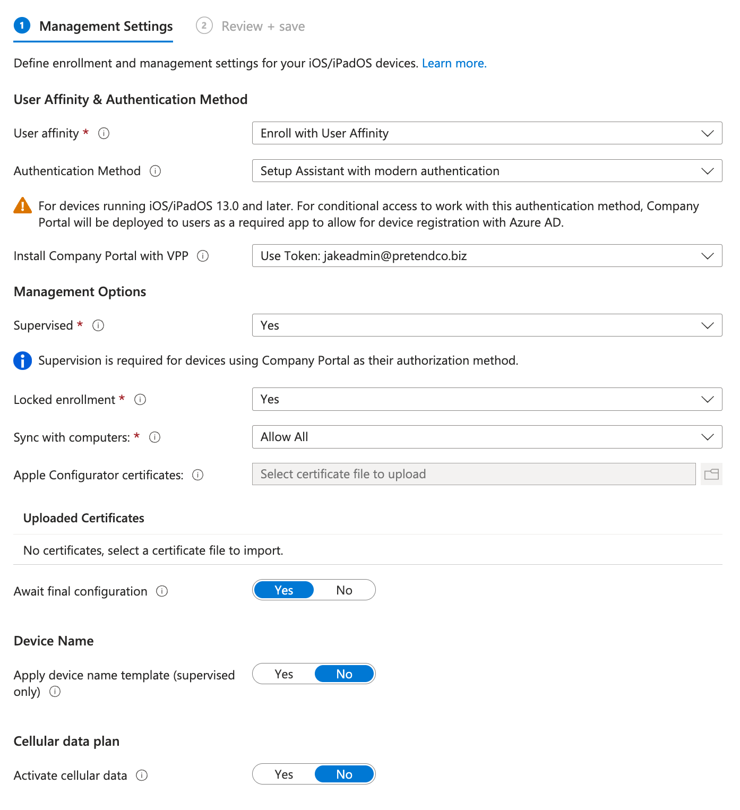

Enter a department Name and Phone Number and toggle all setup assistant screens to Hide except

Passcode = `Show`

Location Services = `Show`

Touch ID and Face ID = `Show`

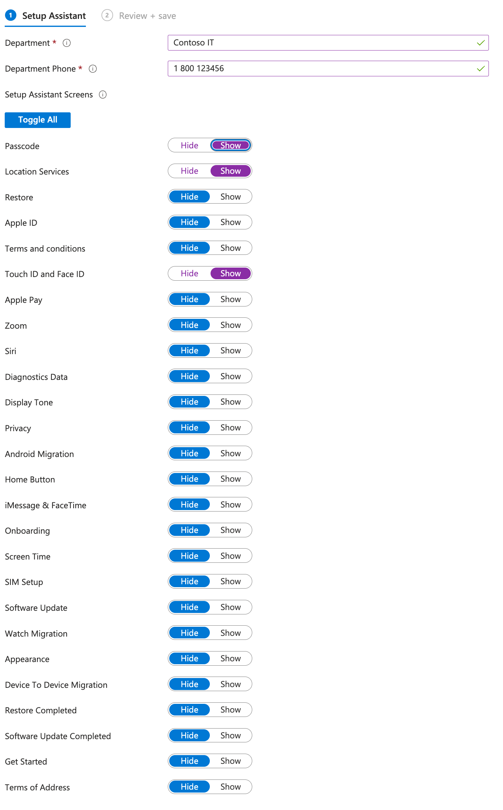


Save the enrolment profile

Click **Set default profile** and set the just created profile as the default for iOS/iPadOS

***
<div style="page-break-after: always"></div>
   
# iOS Configuration Profiles

*Create a few essential configuration profiles. The method is the same in each case with one possible key difference. Use of a Template or the Setting Catalog.*

## Passcode Compliance Policy

*Setting a Compliance Policy creates a configuration profile and also implements a corresponding compliance check in Intune. This policy is used to ensure a device passcode is set with appropriate complexity.*

[https://learn.microsoft.com/en-us/mem/intune/protect/compliance-policy-create-ios](https://learn.microsoft.com/en-us/mem/intune/protect/compliance-policy-create-ios)

<br>

In the **Intune UI**

Navigate to **Devices -> iOS/iPadOS -> Compliance**

Click **+ Create policy** to Create a new policy then Create a Policy **Create**

Give the policy a name e.g. `Passcode` then click **Next**

Under **System Security**

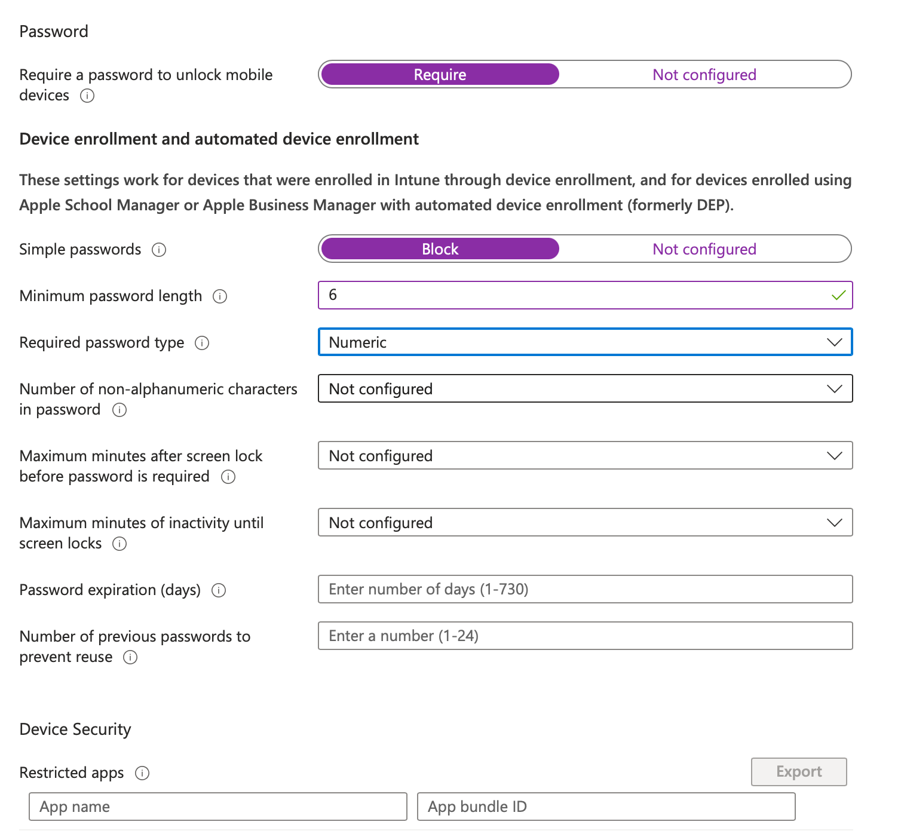


Click **+ Add all devices**

_**Note:** You can refine your scope by using Assignment Filters. See [Using Assignment Filters](#using-assignment-filters)_

Click **Next**

Click **Create**

***
<div style="page-break-after: always"></div>

## Managed Open In Profile

*The Managed Open profile is used to implement the Managed Open In controls on iOS and iPadOS that limit the flow of data between managed and unmanaged apps.*

In the **Intune UI**

Navigate to **Devices -> iOS/iPadOS -> Configuration**

Click **+ Create  -> + New Policy** to Create a new profile

Click **Profile Type - Settings Catalog** then **Create**

Give the profile a name e.g. `Managed Open In` then click **Next**

Click **+ Add settings** and choose **Restrictions** and select the settings in the screenshot below and close the **Settings Picker**

Set the values to True or False as shown

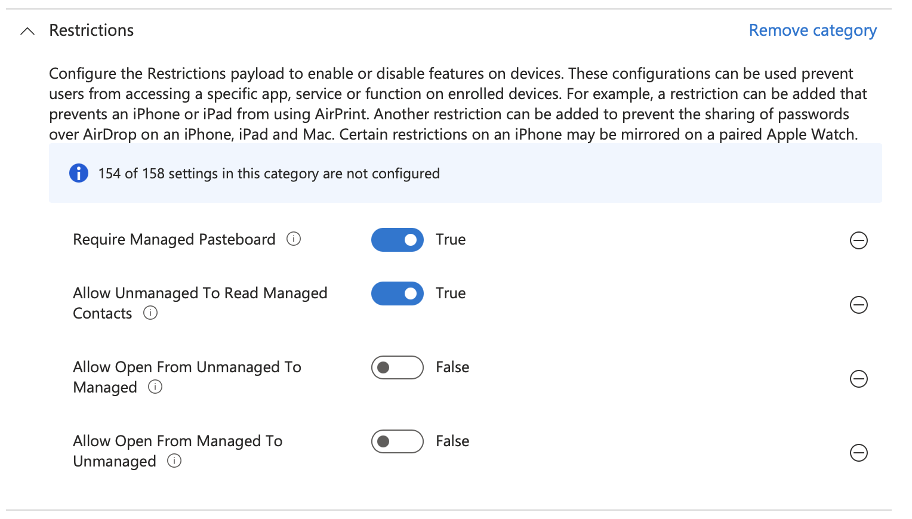

Click **Next** then on Scope Tags click **Next**

In Assignments Click **+ Add all devices** (Optionally apply a Filter)

Click **Next** then Click **Create**

***
<div style="page-break-after: always"></div>

## Single Sign On Profile

*The Single Sign On profile enables the use of Apple's Extensible Single Sign On framework in conjunction with the Entra ID SSO Extension to reduce the burden on users logging in while maintained strong authentication and authorisation using modern authentication protocols. This also requires that Microsoft Authenticator is installed on the device.*


In the **Intune UI**

Navigate to **Devices -> iOS/iPadOS -> Configuration**

Click **+ Create  -> + New Policy** to Create a new profile

Click **Profile Type - Settings Catalog** then **Create**

Give the profile a name e.g. `Entra ID SSO` then click Next

Click **+ Add settings** and choose **Authentication -> Extensible Single Sign On (SSO)** and select the settings in the screenshot below and close the Settings Picker

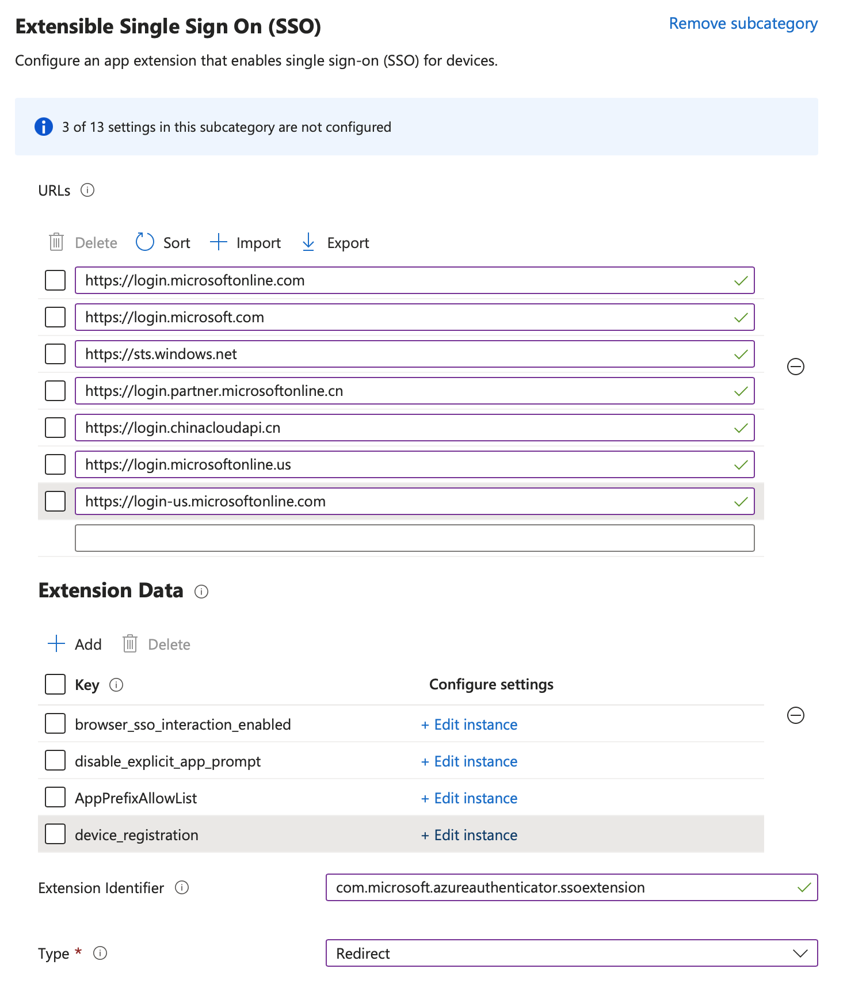

| Key                             | Type    | Value                     |
| ------------------------------- | ------- | ------------------------- |
| browser_sso_interaction_enabled | Integer | 1                         |
| disable_explicit_app_prompt     | Integer | 1                         |
| AppPrefixAllowList              | String  | com.microsoft.,com.apple. |
| device_registration             | String  | {{DEVICEREGISTRATION}}    |

Click **Next** then on Scope Tags click **Next**

In Assignments Click **+ Add all devices**

Click **Next** then Click **Create**

***
<div style="page-break-after: always"></div>

## Email Profile

*The Email profile will add an account the the native iOS Mail app on behalf of the user.*

In the **Intune UI**

Navigate to **Devices -> iOS/iPadOS -> Configuration**

Click **+ Create  -> + New Policy** to Create a new profile

Click **Profile Type - Templates** then **Email** then **Create**

Give the profile a name e.g. `Exchange` Online then click **Next**

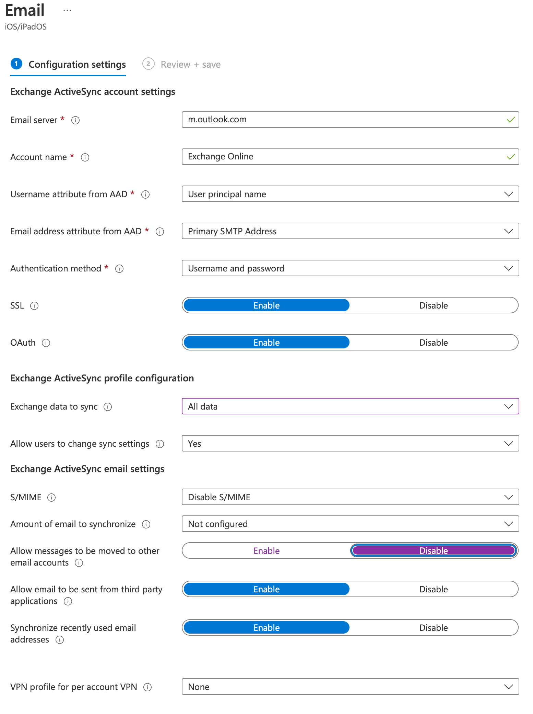


Click **+ Add all devices**

Click **Next**

Click **Create**

***
<div style="page-break-after: always"></div>

## Set Wallpaper

*The Email profile will add an account the the native iOS Mail app on behalf of the user.*

In the **Intune UI**

Navigate to **Devices -> iOS/iPadOS -> Configuration**

Click **+ Create  -> + New Policy** to Create a new profile

Click **Profile Type - Templates** then **Device Features** then **Create**

Give the profile a name e.g. `Manage Devices Wallpaper` then click **Next**

On the **Configuration Settings** screen select **Wallpaper**

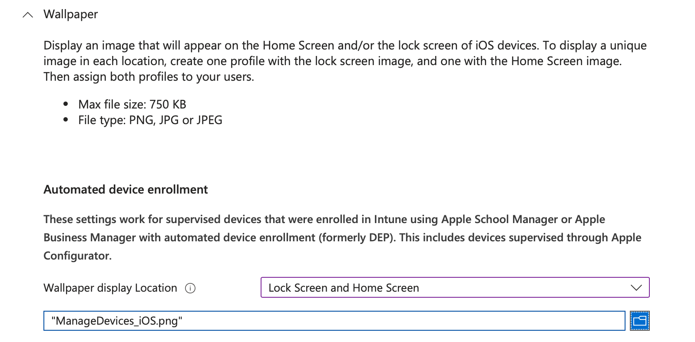


Click **+ Add all devices**

Click **Next**

Click **Create**

***
<div style="page-break-after: always"></div>

# iOS App Deployment

## VPP

### Deploy Microsoft Authenticator

In **Apple Business Manager**

In the sidebar click **Apps and Books**

Search for **Microsoft Authenticator** and select the iOS version

Under Buy Licenses select the location corresponding to your Intune instance and specify 10 in the quantity then click **Get**
<br>

In the **Intune UI**

Navigate to **Apps -> iOS/iPadOS**

Select **Microsoft Authenticator** from the list of available apps. If it is not listed try clicking Refresh

Click on **Properties**

Click on Assignments **Edit** and assign the app under Required -> **+ Add all devices** then **Review + save**

### Deploy Additional Apps

Repeat the above process to deploy additional apps such as **Microsoft Teams** and **OneDrive** and **Outlook*

You can make apps appear as optional installs within the Company Portal app by assigning them as **Available** for enrolled devices rather than **Required**

***NOTE: It may be necessary to force synchronisation after the ABM app purchase*** 

<br>

**In the Intune UI**

Navigate to **Tenant administration -> Connectors and tokens -> Apple VPP Tokens**

Right click on the token name and select **Sync**

***
<div style="page-break-after: always"></div>

# iOS App Configuration

*These settings are app specific and control, behaviour of the specific apps as determined by the app developer. The example below sets the UPN used by Teams based on the user that enrolled the device*

## Teams

In the Intune UI

**Apps -> Configuration**

Click **+ Add -> Managed Devices**

Give the policy a name e.g. `Teams UPN`

Select Platform **iOS/iPadOS**

Targeted App -> Select **Microsoft Teams**

Click **Next**

Configuration settings format -> select **Use configuration designer**

Enter values as follows:

| Key                          | Type   | Value                 |
| ---------------------------- | ------ | --------------------- |
| IntuneMAMAllowedAccountsOnly | String | Enabled               |
| IntuneMAMUPN                 | String | {{userprincipalname}} |


Set Scope to **All devices**

Click **Next**

Click **Create**

***
<div style="page-break-after: always"></div>

# iOS Device Assignment

In **Apple Business Manager**

From the sidebar click **Devices**

Search for the serial number of the iPhone you will enrol and select it

Click **Edit MDM Server**

Click **Assign the Following MDM** and choose the appropriate MDM from the drop down list then click Continue


In the **Intune UI**

Navigate to **Devices -> iOS/iPadOS -> iOS/iPadOS Enrollment**

Click **Enrollment program tokens**

Select the token you created from the list

Under Manage click **Devices**

If the device you assigned from ABM is not listed click **Sync**, wait a minute and click Refresh

Check the box next to the device(s) in the list that you wish to apply an ADE profile then click **Assign Profile**

Under Assign Profile select the appropriate enrolment profile from the drop down list

Click **Sync** to sync with ABM. This can be done only after 15 mins or more from the last manual sync.

## Enrolment Test

You can now test the enrolment process on the iPhone you have assigned

***
<div style="page-break-after: always"></div>

# macOS

## Mac Device Enrollment Profile

*The Device Enrollment Profile is created by the MDM and synchronised with Apple Business Manager or Apple School Manager to enable the Automated Device Enrolment process. A Device Enrollment Profile is created and assigned to one or more devices. Upon activation that profile will be installed on the device which will provide certificates and the URL of the MDM that will manage the device. A list of Setup Assistant items to hide from the user is also provided.*
<br>

In the **Intune UI**

Navigate to **Devices -> macOS -> Enrollment**

Click **Enrollment program tokens**

Click the token you created from the list

Under Manage click **Profiles**

Click **+ Create Profile -> macOS**

Complete the config as follows:

Name the profile e.g. `macOS ADE with MFA`

User affinity = `Enroll with User Affinity`

Authentication Method = `Setup Assistant with modern authentication`

Locked Enrollment = `Yes`

Enter a department Name and Phone Number and toggle all setup assistant  
screens to Hide except

Location Services = `Show`

Touch ID and Face ID = `Show`

Configure Account Settings

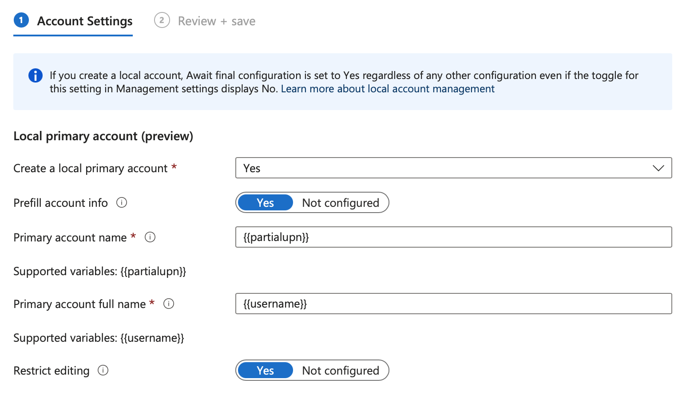


Click **Create**

Click **Set default profile** and set the just created profile as the default for macOS

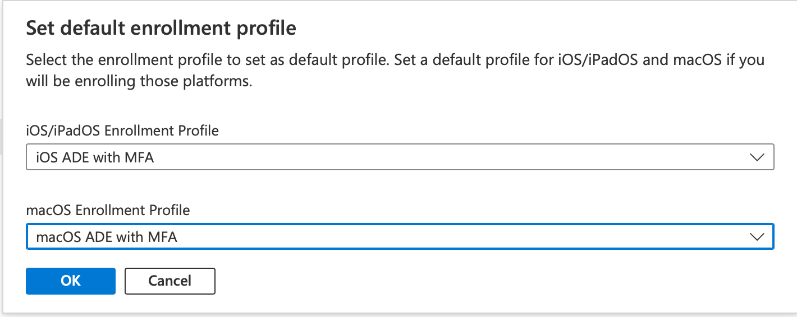


***
<div style="page-break-after: always"></div>

# Mac Configuration Profiles

Create a few essential configuration profiles. The method is the same in each case with one possible key difference. Use of a Template of the Setting catalog. An example of each is given.

For configuration profiles created using the Settings Catalog there is an Export JSON capability. There is a corresponding capability to select Import Policy as an option when creating a new configuration profile so previous configs can be reused.


## FileVault Profile

*This profile enforces enables FileVault full disk encryption.*

<br>

In the **Intune UI**

Navigate to **Devices -> macOS -> Configuration**

Click **+ Create  -> + New Policy** to Create a new profile

Click **Profile Type - Settings Catalog** then **Create**

Give the profile a name e.g. `FileVault` then click **Next**

Click **+ Add settings** and choose **Full Disk Encryption** and select the settings in the screenshot below and close the Settings Picker.

Make the selections as shown

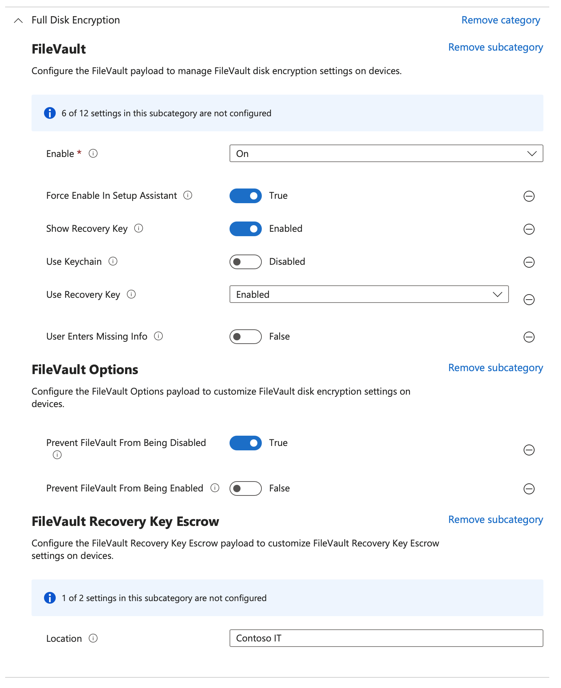

Click **Next** then on Scope Tags click **Next**

In Assignments Click **+ Add all devices**

Click **Next** then Click **Create**

***
<div style="page-break-after: always"></div>

## Firewall Profile

*This profile enables the built in macOS Application Firewall*

<br>

In the **Intune UI**

Navigate to **Devices -> macOS -> Configuration**

Click **+ Create  -> + New Policy** to Create a new profile

Click **Profile Type - Settings Catalog** then **Create**

Give the profile a name e.g. Firewall then click **Next**

Click **+ Add settings** and choose **Networking -> Firewall** and select the settings in the screenshot below and close the **Settings Picker**

Make the selections as shown

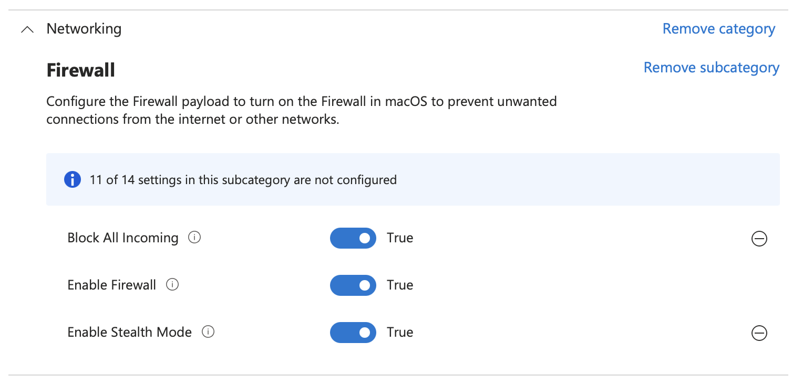


Click **Next** then on Scope Tags click **Next**

In Assignments Click **+ Add all devices**

Click **Next** then click **Create**

***
<div style="page-break-after: always"></div>

## Gatekeeper Profile

*This profile enables Gatekeeper to ensure only trusted apps can launch on macOS*

In the **Intune UI**

Navigate to **Devices -> macOS -> Configuration**

Click **+ Create  -> + New Policy** to Create a new profile

Click **Profile Type - Settings Catalog** then **Create**

Give the profile a name e.g. Gatekeeper then click **Next**

Click **+ Add settings** and choose setting from **App Store, System Policy** and select the settings in the screenshot below and close the **Settings Picker**

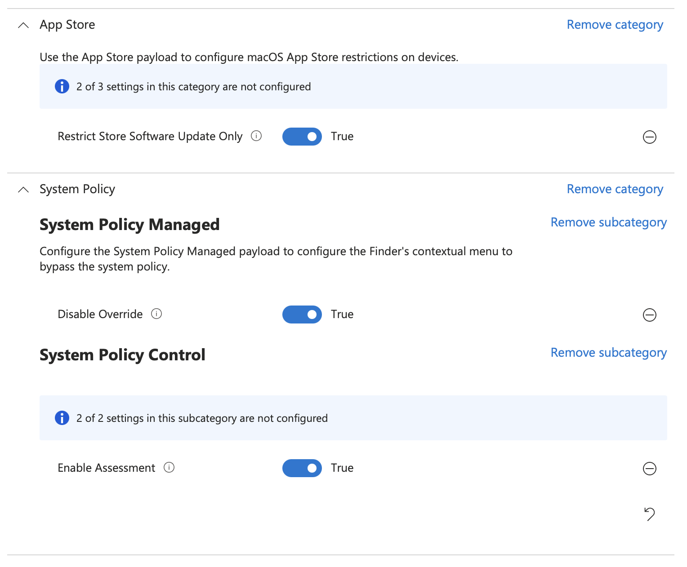

Click **Next** then on Scope Tags click **Next**

In Assignments Click **+ Add all devices**

Click **Next** then Click **Create**

***
<div style="page-break-after: always"></div>

## Platform SSO Profile

*The Platform Single Sign On profile enables the use of Apple's Single Sign On framework in conjunction with the Entra ID PSSO Extension to reduce the burden on users logging in while maintained strong authentication and authorisation using modern authentication protocols. This also requires that Company Portal is installed on the device.*

<br>

In the **Intune UI**

Navigate to **Devices -> macOS -> Configuration**

Click **+ Create  -> + New Policy** to Create a new profile

Click **Profile Type - Settings Catalog** then **Create**

Give the profile a name e.g. `Entra ID PSSO` then click **Next**

Click **+ Add settings** and choose **Authentication -> Extensible Single Sign On (SSO)** and select the settings in the screenshot below and close the **Settings Picker**

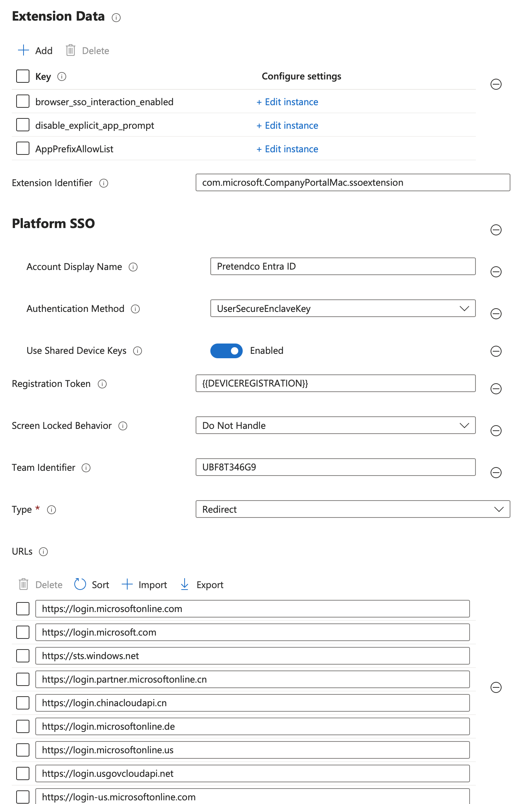

| Key                             | Type    | Value                     |
| ------------------------------- | ------- | ------------------------- |
| browser_sso_interaction_enabled | Integer | 1                         |
| disable_explicit_app_prompt     | Integer | 1                         |
| AppPrefixAllowList              | String  | com.microsoft.,com.apple. |

Click **Next** then on Scope Tags click **Next**

In Assignments Click **+ Add all devices**

Click **Next** then Click **Create**

***
<div style="page-break-after: always"></div>

## Office 365 Profile

*This sets some parameters for Office 365 including the default user for licensing*
<br>

In the **Intune UI**

Navigate to **Devices -> macOS -> Configuration**

Click **+ Create  -> + New Policy** to Create a new profile

Click **Profile Type - Settings Catalog** then **Create**

Give the profile a name e.g. Office 365 Parameters then click **Next**

Click **+ Add settings** and choose **Microsoft Office -> Microsoft Office** then click the **Enable Automatic sign-in** and **Office Activation Email Address** checkboxes and close the **Settings Picker**

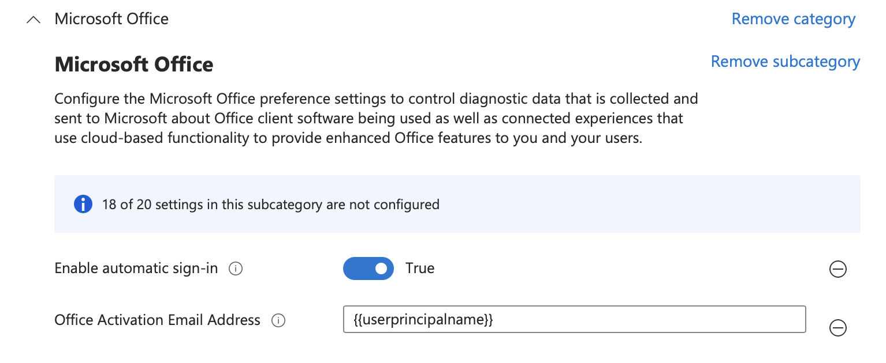

Under **Assignments** click **+Add all devices**

***
<div style="page-break-after: always"></div>

## Custom Profiles

*These profiles set the configuration of the Baseline App and the Support App which we will install as part of this setup.*

Create a custom config for the Baseline and Support app as per the documentation on the developers web sites.

This can be done with a text editor or a tool like [iMazing Profile Editor](https://imazing.com/profile-editor).

[Baseline Sample Configs](https://github.com/SecondSonConsulting/Baseline/tree/main/ExampleConfigurationFiles)

[Support App Sample Config](https://github.com/root3nl/SupportApp/blob/master/Configuration%20Profile%20Samples/Support%20App%20Configuration%20Sample.mobileconfig)

The Baseline Config for this workshop can be found here - [Baseline Configuration File](#baseline-configuration-profile)


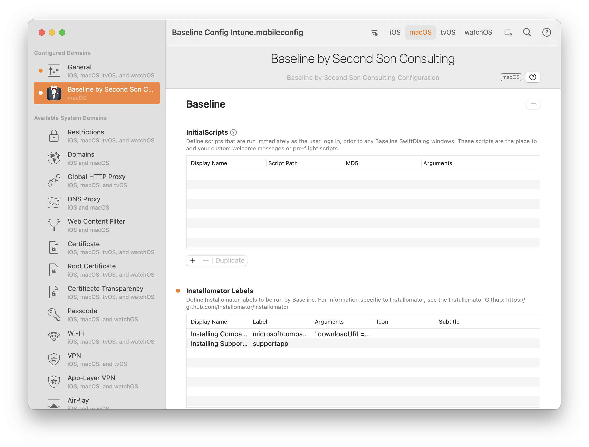

In the **Intune UI**

Navigate to **Devices -> macOS -> Configuration**

Click **+ Create  -> + New Policy** to Create a new profile

Click **Profile Type -> Templates** then **Custom** then **Create**

Give the profile a name e.g. Baseline App Config then click **Next**

For **Custom configuration profile name enter** Baseline App Config

Set **Deployment Channel** to **Device Channel**

Upload the Custom Configuration profile file. Use filename `Baseline Config Intune.mobileconfig`

Under **Assignments** click **+Add all devices**

***Repeat the above process for The Support app and the Privileges app***

***
<div style="page-break-after: always"></div>

## Managed Login Items Profile

*Any background items that run upon a device boot or at user login including Launch Daemons, Launch Agents and Open at Login Apps can be deactivated by an Admin user. In order to prevent these items being deactivated a Managed Login Items config profile is deployed.*

In the **Intune UI**

Navigate to **Devices -> macOS -> Configuration**

Click **+ Create  -> + New Policy** to Create a new profile

Click **Profile Type - Settings Catalog** then **Create**

Give the profile a name e.g. Background and Login Items then click **Next**

Click **+ Add settings** and choose **Login -> Service Management - Managed Login Items** then check all but **Team Identifier** and close the **Settings Picker**

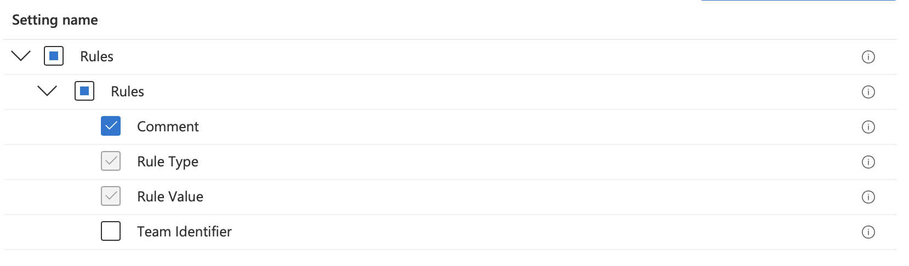

Enter the following values: 

| Comment           | Rule Type                | Rule Value          | Team Identifier  | 
| ----------------- | ------------------------ | ------------------- | ---------------- |
| Microsoft Apps    | Bundle Identifier Prefix | com.microsoft       | _Not Configured_ |
| Microsoft Daemons | Label Prefix             | com.microsoft       | _Not Configured_ |
| Support App       | Label                    | nl.root3.support    | _Not Configured_ |
| Privileges App    | Bundle Identifier        | corp.sap.privileges | _Not Configured_ |

Under **Assignments** click **+Add all devices**

***
<div style="page-break-after: always"></div>

# Mac App Deployment

## Apple App Store (VPP)

### Deploy Outlook

In **Apple Business Manager**

In the sidebar click **Apps and Books**

Search for **Microsoft Outlook** and select the macOS version

Under Buy Licenses select the location corresponding to your Intune instance and specify 10 in the quantity then click **Get**
<br>

In the **Intune UI**

**Apps -> macOS**

Select **Microsoft Outlook** from the list of available apps. If it is not listed try clicking **Refresh**

Under **Properties -> Assignments** click **Edit** and click **+Add all devices**

***
<div style="page-break-after: always"></div>

## Line of Business / Packaged

### Deploy Baseline

_The Baseline App runs after the Setup Assistant completes and installs other necessary apps before the user gets to the Desktop. For this example Baseline installs Microsoft Company Portal, the Support app and the Privileges app. These options were configured earlier using the Custom Profile for Baseline_

_Intune supports two methods to deploy .pkg files. As this package has been created and signed by the developer we will use the Line-of-business method that leverages the MDM command InstallEnterpriseApplication._

Download the latest packaged version of Baseline from [https://github.com/SecondSonConsulting/Baseline/releases/tag/v2.2](https://github.com/SecondSonConsulting/Baseline/releases/tag/v2.2)
<br>

In the **Intune UI**

**Apps -> macOS**

Click **+ Add**

From the drop down menu select **Other -> Line-of-business app**

Upload the Baseline App package file `Baseline_v2.2.pkg`

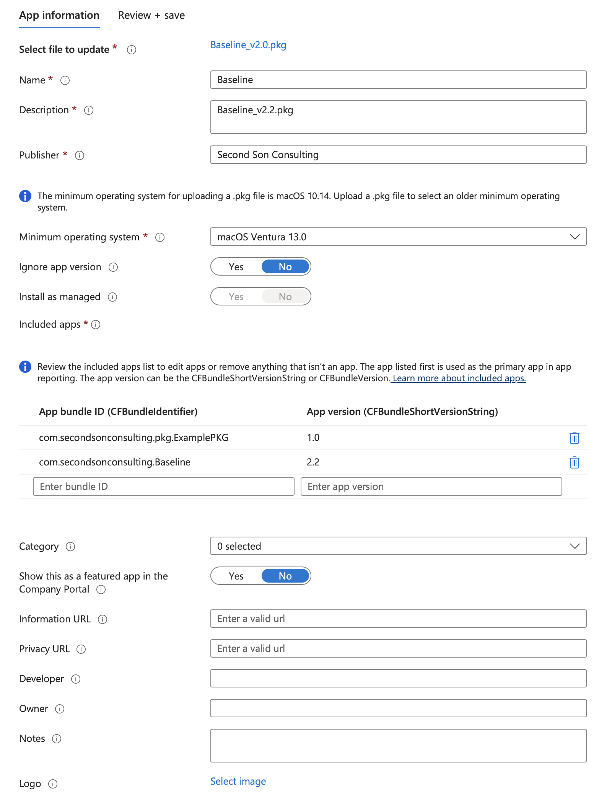

Under **Assignments -> Required** click **+Add all devices**

***
<div style="page-break-after: always"></div>

## Built In Apps

### Deploy Microsoft Office

_This will deploy most of the Microsoft Office Suite of apps for Mac. We have already deployed Outlook via the Mac app store and this will reinstall it. The reason to have deployed Outlook earlier is for speed. In a real world scenario there is no need for the overlap_

In the **Intune UI**

Navigate to **Apps -> macOS**

Click **+Add**

From the **App type** drop down list select **Microsoft 365 Apps / macOS**

Under **Assignments -> Required** click **+Add all devices**

***
<div style="page-break-after: always"></div>

## Scripting

### Deploy Microsoft Windows App

_This app is not available on the Mac App store so we need an alternative method to install it. Scripting is one alternative that will be used here._

In a new browser window or tab open [https://github.com/microsoft/shell-intune-samples/blob/master/macOS/Apps/Remote%20Desktop/installRemoteDesktop.sh](https://github.com/microsoft/shell-intune-samples/blob/master/macOS/Apps/Remote%20Desktop/installRemoteDesktop.sh)

Copy the contents of the bash script, paste in to a text editor and save the file as `InstallRemoteDesktop.sh`
<br>

In the **Intune UI**

Navigate to **Devices -> macOS -> Scripts**

Click **+ Add**

Name the Script e.g. Install Teams and click **Next**

Upload the saved `InstallRemoteDesktop.sh` file and set the parameters as 

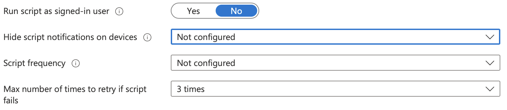

Under **Assignments** click **+Add all devices**

***
<div style="page-break-after: always"></div>

# Mac Additional Setup

## Set Mac Wallpaper (Optional)

*In order to use a custom image as the Mac Wallpaper the image file needs to be installed on the device. There are multiple methods to then set this image as the Wallpaper. This example uses a custom package to install the images and then uses a configuration profile to set the Wallpaper.*

Create the .pkg file using a tool such as [Packages from Whitebox](http://s.sudre.free.fr/Software/Packages/about.html) and name it `Wallpaper.pkg`. This just needs to put the required image(s) into a directory on the Mac. e.g. `/usr/local/wallpaper/background.png`

<br>

In the **Intune UI**

**Apps -> macOS**

Click **+ Add**

From the drop down menu select **Other -> macOS App (PKG)** then click **Select**

Click **Select app package file** and choose the `Wallpaper.pkg` file

Under **App Information** set

**Name** = `Wallpaper`
**Description** = `Wallpaper images`
**Publisher** = `managedevices.biz`

Click **Next** then **Next**

Set **Minimum operating system** = `macOS Ventura 13.0`

Under **Detection Rules** leave the defaults and click **Next**

Under **Assignment** choose **Add all devices** then click **Next** then **Create**

<br>

In the **Intune UI**

Navigate to **Devices -> macOS -> Configuration Profiles**

Click **+ Create** to Create a new profile

Click **Profile Type - Settings Catalog** then **Create**

Give the profile a name e.g. `Set Wallpaper` then click **Next**

Click **+ Add settings** and choose **User Experience > Desktop** then check **Override Picture Path** and close the **Settings Picker**

Set **Override Picture Path** to `/usr/local/wallpaper/ManageDevices_macOS.png`


Click **Next** then on Scope Tags click **Next**

In Assignments Click **+ Add all devices**

Click **Next** then Click **Create**

***
<div style="page-break-after: always"></div>

# Compliance Policies

## Disk Encryption Policy

*Intune can implement Compliance Policies which are evaluated as true or*false. This calculated state can be used by Azure AD Conditional Access polices to determine whether a user can access certain cloud based**resources from the device.*
<br>

In the Intune UI

Navigate to **Devices -> macOS -> Compliance policies**

Click **+ Create policy** to Create a new policy

Give the profile a name e.g. `Basic Compliance` then click **Next**

Set the following:

**Device Health -> Require System Integrity Protection** to `Require`

**System Security -> Device Security -> Firewall** to `Enable`

**System Security -> Device Security -> Incoming Connections** to `Block`

**System Security -> Device Security -> Stealth Mode** to `Enable`

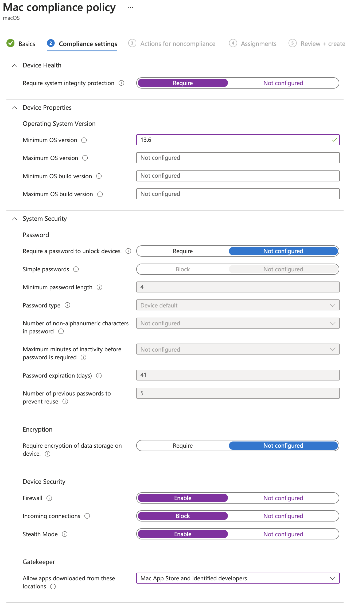

Set the **Action** to **Mark device noncompliant** and the **Schedule** to **Immediately**

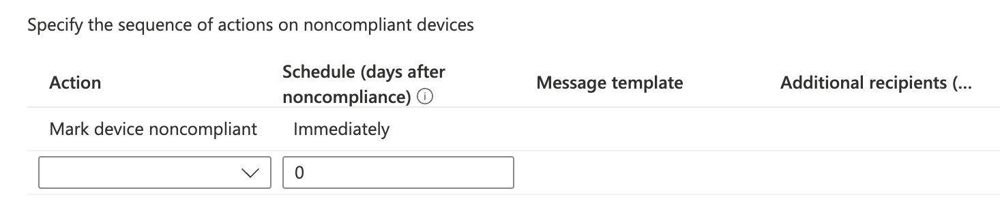

Under Assignments click **+Add all devices**

***
<div style="page-break-after: always"></div>

# Mac Device Assignment

In **Apple Business Manager**

From the sidebar click **Devices**

Search for the serial number of the Mac you will enrol and select it

Click **Edit MDM Server**

Click **Assign the Following MDM** and choose the appropriate MDM from the drop down list then click **Continue**
<br>

In the **Intune UI**

Navigate to **Devices -> macOS -> macOS Enrollment**

Click **Enrollment program tokens**

Select the token you created from the list

Under Manage click **Devices**

If the device you assigned from ABM is not listed click **Sync**, wait a minute and click **Refresh**

Check the box next to the device(s) in the list that you wish to apply an ADE profile then click **Assign Profile**

Under Assign Profile select the appropriate enrolment profile from the drop down list

Click **Sync** to sync with ABM. This can be done only after 15 mins or more from the last manual sync.

## Enrolment Test

You can now test the enrolment process on the Mac you have assigned

Check profiles in the settings app.

Once Company Portal is installed launch it and log in. The device should appear non compliant.

Log out and back in again enabling FileVault in the process.

Log back into Company Portal and see the device is now compliant

Launch Apps, open [https://portal.office.com](https://portal.office.com) in Safari and add Exchange account to Mail.

***
<div style="page-break-after: always"></div>

# Assignments / Scoping

## Using Assignment Filters 

_In this workshop most examples of scoping use a scope of **All Devices** for simplicity and performance. When you want to limit the scope of devices but want to get the performance benefits of scoping to **All Devices** you can use a Filter_

Navigate to **Devices -> Tenant administration -> Assignment Filters**

Click **Create -> Managed Devices**

Give the Filter a name e.g. `Enrollment Profile = iOS ADE with MFA` and under **Platform** choose **iOS/iPadOS** then click **Next**

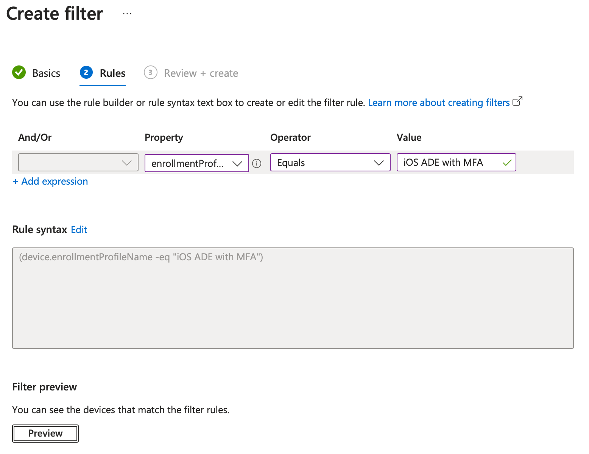

Click **Next** then Click **Create**

When scoping something that supports Assignment Filters you can use them as in the following example of scoping a configuration profile that is currently scoped to **All Devices**

Under the **Assignments** screen for a Configuration Profile Click on **Edit Filter**

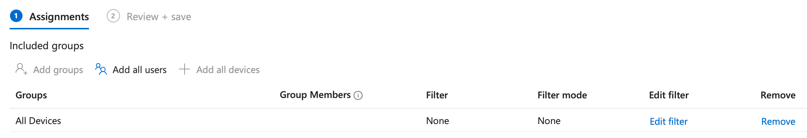

Select **Include filtered devices in assignment** then slelct the previouly created Filter called `Enrollment Profile = iOS ADE with MFA`then click **Select**

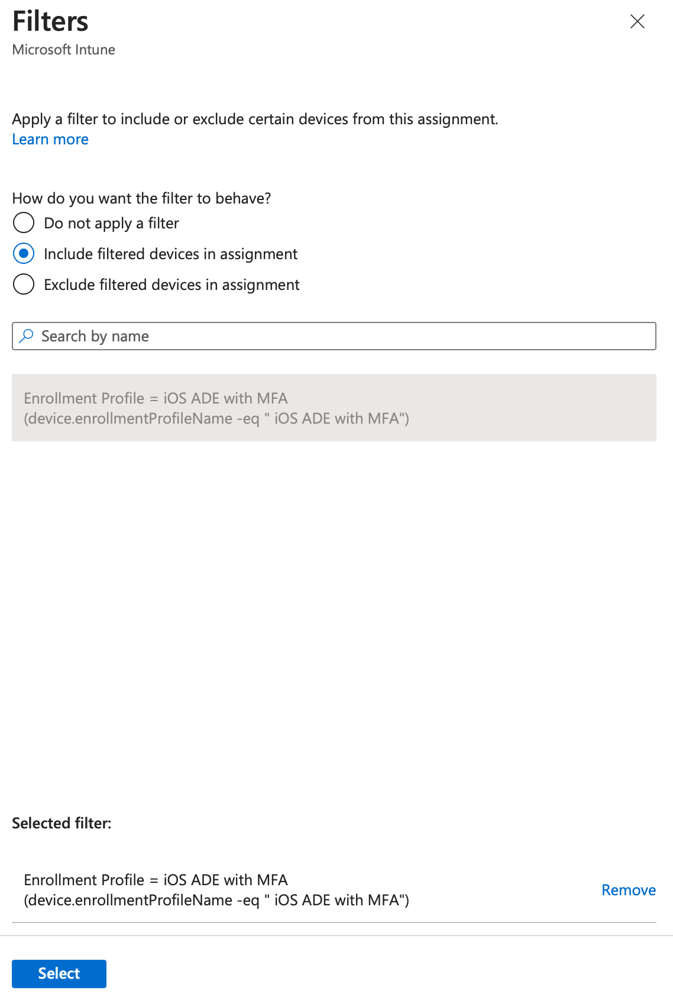

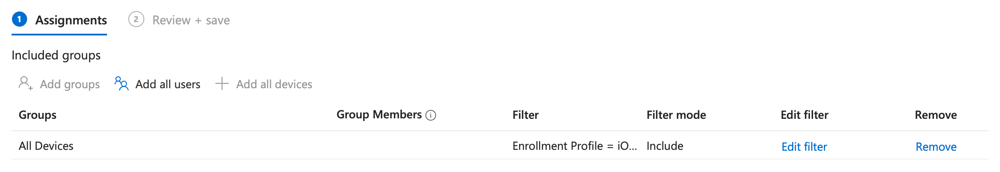

***
<div style="page-break-after: always"></div>

# Mac Operations

## Software Updates

In the **Intune UI**

Navigate to **Devices -> macOS -> Update policies for macOS**

Click **+ Create** to Create a new profile

Give the profile a name then click **Next**

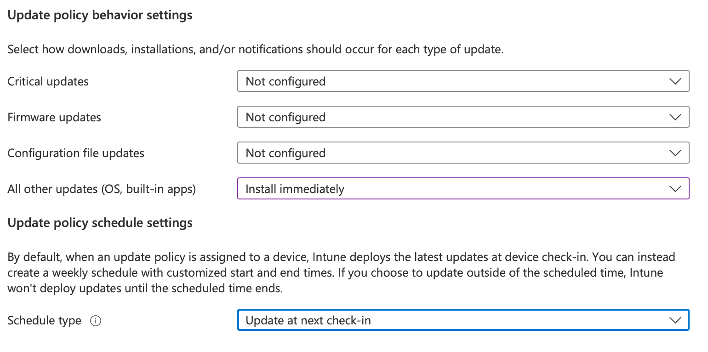

***
<div style="page-break-after: always"></div>

## DDM Software Updates

In the **Intune UI**

Navigate to Devices -> macOS -> Configuration Profiles

Click **+ Create** to Create a new profile

Click **Profile Type - Settings Catalog** then **Create**

Give the profile a name e.g. `macOS Software Update` then click **Next**

Click **+ Add settings** and choose **Declarative Device Management (DDM) -> Software Update** then check Local Date and Time and Target OS Version and close the Settings Picker


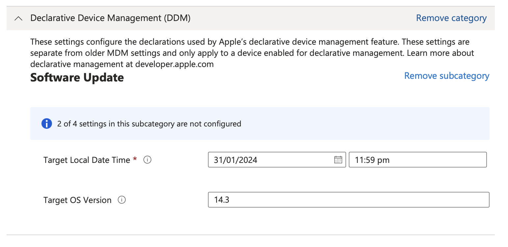

***
<div style="page-break-after: always"></div>

## FileVault Key Escrow

In the **Intune UI**

Navigate to **Devices -> macOS**

Select the relevant Mac from the list of devices

Click **Recovery Keys** then **Show Recovery Key**

## Erase All Content and Settings

In the **Intune UI**

Navigate to **Devices -> macOS**

Select the relevant Mac from the list of devices

Click **X Erase**

Enter any Recovery PIN then click **Erase**

***
<div style="page-break-after: always"></div>

# Additional Mac Config Profiles

*When you run the Mac Evaluation Utility on a Mac there is a category Mac Management -> Security with a number of items that are evaluated. The following profiles can help achieve a Success status for some of these items.*

## Disable the Guest Account

In the **Intune UI**

Navigate to **Devices -> macOS -> Configuration Profiles**

Click **+ Create** to Create a new profile

Click **Profile Type -> Settings Catalog** then **Create**

Give the profile a name e.g. Disable Guest Account then click **Next**

Click **+ Add settings** and choose **Accounts -> Accounts -> Disable Guest Account**

Then set **Disable Guest Account** to **True**

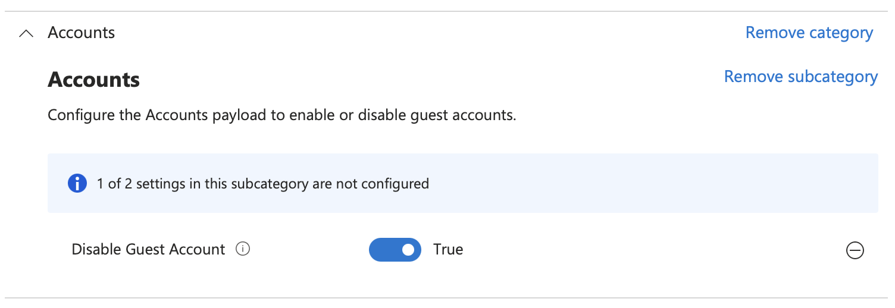

***
<div style="page-break-after: always"></div>

## Disable Auto-login

In the **Intune UI**

Navigate to **Devices -> macOS -> Configuration Profiles**

Click **+ Create** to Create a new profile

Click **Profile Type -> Templates** then **Custom** then **Create**

Give the profile a name e.g. Disable Auto Login then click **Next**

For **Custom configuration profile name enter Disable Auto Login**

Set **Deployment Channel** to **Device Channel**

Upload the Custom Configuration profile file

Assign to All Devices

```xml
<?xml version="1.0" encoding="UTF-8"?>
<!DOCTYPE plist PUBLIC "-//Apple//DTD PLIST 1.0//EN" "http://www.apple.com/DTDs/PropertyList-1.0.dtd">
<plist version="1.0">
<dict>
    <key>PayloadContent</key>
    <array>
        <dict>
            <true/>
            <key>com.apple.login.mcx.DisableAutoLoginClient</key>
        </dict>
    </array>
    <key>PayloadDisplayName</key>
    <string>Login Window</string>
    <key>PayloadIdentifier</key>
    <string>com.example.myprofile</string>
    <key>PayloadType</key>
    <string>Configuration</string>
    <key>PayloadUUID</key>
    <string>61bd7d63-4a4a-4b67-9112-5ceb16afb4dc</string>
    <key>PayloadVersion</key>
    <integer>1</integer>
</dict>
</plist>
```

***
<div style="page-break-after: always"></div>

## Configure Screensaver Lock

In the **Intune UI**

Navigate to **Devices -> macOS -> Configuration Profiles**

Click **+ Create** to Create a new profile

Click **Profile Type -> Settings Catalog** then **Create**

Give the profile a name e.g. Screensaver Lock then click **Next**

Click **+ Add settings** and choose **System Configuration -> Screensaver -> Select all these settings**

**Module Name =** _Preferred Value_

**Login Window Module Path =** `/System/Library/`

**Login Window Idle Time =** _Preferred Value_

**Ask For Password Delay =** _Preferred Value_

**Ask For Password =** `True`
***
<div style="page-break-after: always"></div>

## Configure Passcode Profile

_**NOTE:** Be sure to set this via the Settings Catalog and not via a Template_

In the **Intune UI**

Navigate to **Devices -> macOS -> Configuration**

Click **+ Create  -> + New Policy** to Create a new profile

Click **Profile Type -> Settings Catalog** then **Create**

Give the profile a name e.g. `Passcode Policy` then click **Next**

Click **+ Add settings** and choose **Security -> Passcode ->** *Needed Settings based on company security policy*

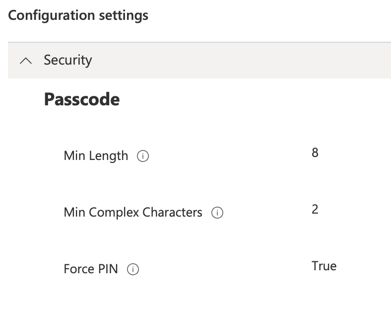

***
<div style="page-break-after: always"></div>

# Resources

## Example Baseline Configuration Profile

```xml
<?xml version="1.0" encoding="UTF-8"?>
<!DOCTYPE plist PUBLIC "-//Apple//DTD PLIST 1.0//EN" "http://www.apple.com/DTDs/PropertyList-1.0.dtd">
<plist version="1.0">
<dict>
	<key>PayloadContent</key>
	<array>
		<dict>
			<key>CleanupAfterUse</key>
			<true/>
			<key>DialogListOptions</key>
			<string>--message "We're setting up a few prerequisites. You will be logged out when finished. Please log in with your local account password."</string>
			<key>DialogSuccessOptions</key>
			<string>--message "Please register this Mac with your Pretendco Entra ID when prompted"</string>
			<key>ExitCondition</key>
			<string>/Applications/Support.app/Contents/Info.plist</string>
			<key>Installomator</key>
			<array>
				<dict>
					<key>Arguments</key>
					<string>"downloadURL=https://go.microsoft.com/fwlink/?linkid=853070"</string>
					<key>DisplayName</key>
					<string>Installing Company Portal</string>
					<key>Label</key>
					<string>microsoftcompanyportal</string>
				</dict>
				<dict>
					<key>DisplayName</key>
					<string>Installing Support App</string>
					<key>Label</key>
					<string>supportapp</string>
				</dict>
			</array>
			<key>LogOut</key>
			<true/>
			<key>Packages</key>
			<array>
				<dict>
					<key>DisplayName</key>
					<string>Installing Privileges App</string>
					<key>PackagePath</key>
					<string>https://github.com/SAP/macOS-enterprise-privileges/releases/download/2.1.0/Privileges_2.1.0.pkg</string>
				</dict>
			</array>
			<key>PayloadDisplayName</key>
			<string>Baseline</string>
			<key>PayloadIdentifier</key>
			<string>com.secondsonconsulting.baseline.0BC8DDD0-22FE-4D64-89A3-1E00FEA08422</string>
			<key>PayloadType</key>
			<string>com.secondsonconsulting.baseline</string>
			<key>PayloadUUID</key>
			<string>759E3975-BA30-4F0A-84F1-89BB23DBF49D</string>
			<key>PayloadVersion</key>
			<integer>1</integer>
			<key>ProgressBar</key>
			<true/>
			<key>ProgressBarDisplayNames</key>
			<true/>
			<key>Restart</key>
			<false/>
		</dict>
	</array>
	<key>PayloadDisplayName</key>
	<string>Baseline Config</string>
	<key>PayloadIdentifier</key>
	<string>Roberts-MacBook-Pro-14.92E98899-A386-42C5-9A4F-6F5978916FE0</string>
	<key>PayloadType</key>
	<string>Configuration</string>
	<key>PayloadUUID</key>
	<string>93C5997E-1E97-4409-B973-CF555B68A1C7</string>
	<key>PayloadVersion</key>
	<integer>1</integer>
</dict>
</plist>
```
## Links to other resources

[Resources Page](Resources.md)

***