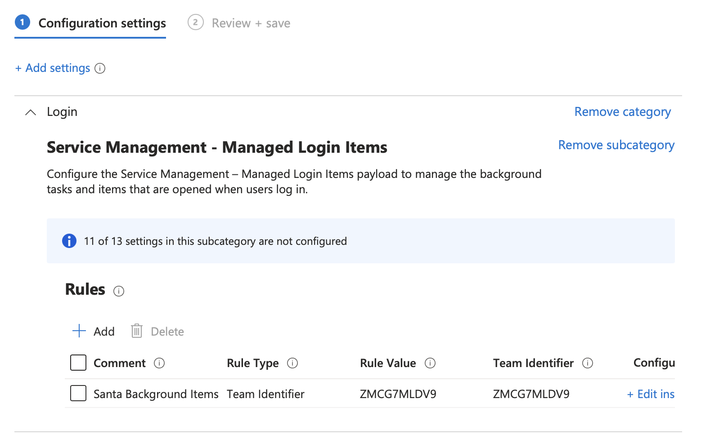
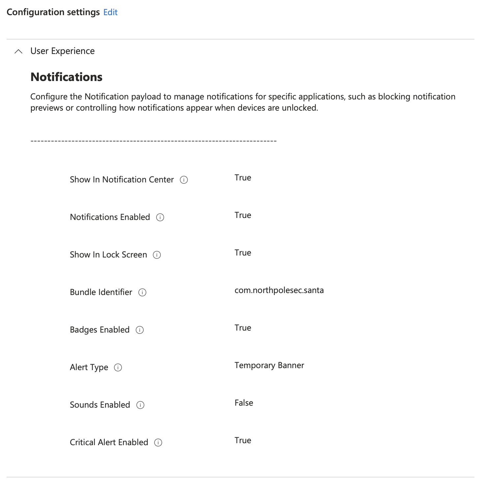
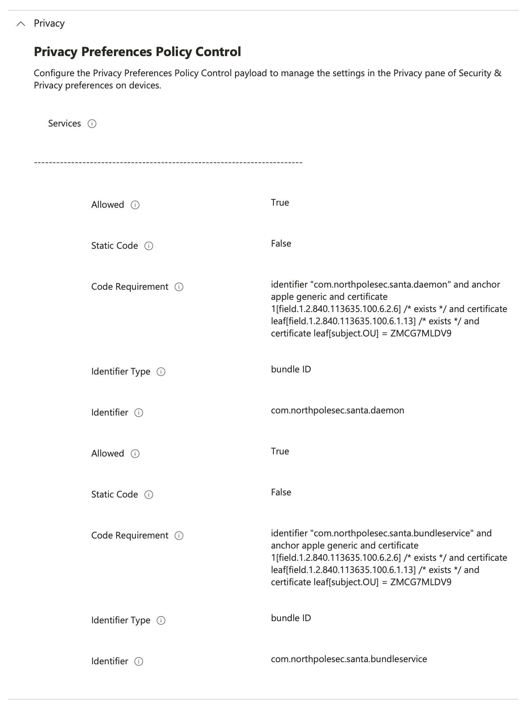
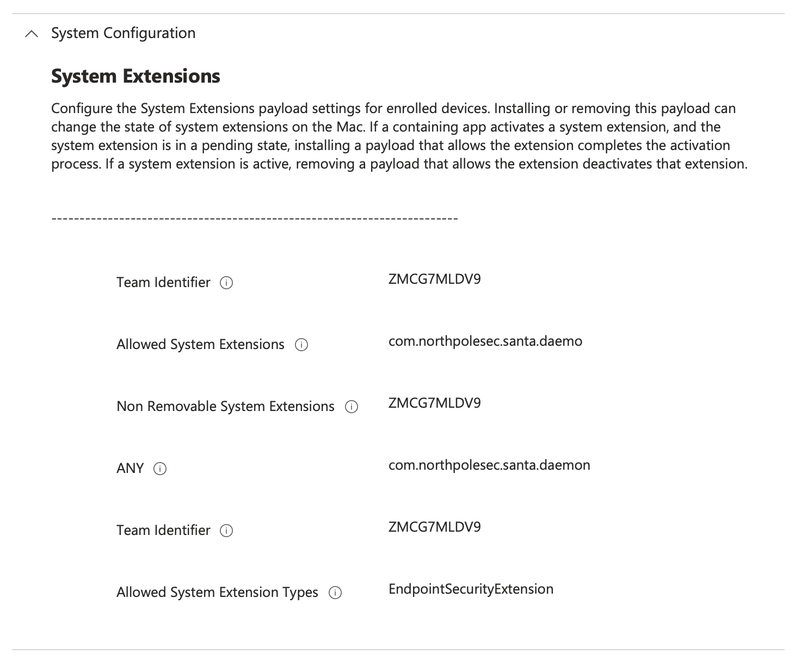

<!-- title: Impelementing North Pole Security Santa with Intune -->

Impelementing North Pole Security Santa with Intune
===================================================

<!-- [](assets/OSList.png) -->

[](assets/Intune_256_Color.png)

<!-- @import "[TOC]" {cmd="toc" depthFrom=1 depthTo=2 orderedList=false} -->

<!-- code_chunk_output -->

- [Introduction](#introduction)
- [Requirements](#requirements)
- [Santa App Installation](#santa-app-installation)
- [Configuration Profiles](#configuration-profiles)
  - [Background and Login Items Profile](#background-and-login-items-profile)
  - [Notifications Profile](#notifications-profile)
  - [Privacy Preferences Policy Control Profile](#privacy-preferences-policy-control-profile)
  - [System Extension Profile](#system-extension-profile)
  - [Sample Santa Policy Config](#sample-santa-policy-config)

<!-- /code_chunk_output -->

***
<div style="page-break-after: always"></div>

# Introduction

The Santa app by North Pole Security leverages the macOS Endpoint Security framework to provide an capp execution control layer to macOS.

[Santa Documentation Site](https://northpole.dev)

# Requirements

In Intune sign in as a member of the *Global Administrator* or *Intune Service Administrator* Entra ID roles

***

# Santa App Installation

Download the latest version of Santa at [Releases · northpolesec/santa · GitHub](https://github.com/northpolesec/santa/releases)

In the **Intune UI**

**Apps -> macOS**

Click **+ Create**

From the drop down menu select **Other -> macOS App (PKG)** then click **Select**

Click **Select app package file** and choose the **santa** pkg you downloaded in the previous step

Under **App Information** set

**Name** = `Santa`
**Description** = `Santa App Control`
**Publisher** = `northpole.security`

Click **Next** then **Next**

Set **Minimum operating system** = `macOS Sanoma 15.0`

Under **Detection Rules** leave the defaults and click **Next**

Under **Assignment** choose **Add all devices** then click **Next** then **Create**

<br>
<div style="page-break-after: always"></div>

***

# Configuration Profiles

## Background and Login Items Profile

*This profile ensures that the Santa Daemon always runs and can't be disabled by the user*

In the **Intune UI**

Navigate to **Devices -> macOS -> Configuration**

Click **+ Create  -> + New Policy** to Create a new profile

Click **Profile Type -> Settings Catalog** then **Create**

Give the profile a name e.g. `Santa - Backgroound and Login` then click **Next**

Click **+ Add settings** and choose setting from **App Store, System Policy** and select the settings in the screenshot below and close the **Settings Picker**



Click **Next** then on Scope Tags click **Next**

In Assignments Click **+ Add all devices**

Click **Next** then Click **Create**

***
## Notifications Profile

*This profile sets the Notification settings for Santa so the user is not prompted to do so*

In the **Intune UI**

Navigate to **Devices -> macOS -> Configuration**

Click **+ Create  -> + New Policy** to Create a new profile

Click **Profile Type -> Settings Catalog** then **Create**

Give the profile a name e.g. `Santa - Notifications` then click **Next**

Click **+ Add settings** and choose setting from **App Store, System Policy** and select the settings in the screenshot below and close the **Settings Picker**



Click **Next** then on Scope Tags click **Next**

In Assignments Click **+ Add all devices**

Click **Next** then Click **Create**

***
## Privacy Preferences Policy Control Profile

*This profile allows Santa Full Disk Access*

In the **Intune UI**

Navigate to **Devices -> macOS -> Configuration**

Click **+ Create  -> + New Policy** to Create a new profile

Click **Profile Type -> Settings Catalog** then **Create**

Give the profile a name e.g. `Santa - PPPC` then click **Next**

Click **+ Add settings** and choose setting from **App Store, System Policy** and select the settings in the screenshot below and close the **Settings Picker**



Click **Next** then on Scope Tags click **Next**

In Assignments Click **+ Add all devices**

Click **Next** then Click **Create**

***
## System Extension Profile

*This profile allows Santa to intsall a System Extension*

In the **Intune UI**

Navigate to **Devices -> macOS -> Configuration**

Click **+ Create  -> + New Policy** to Create a new profile

Click **Profile Type -> Settings Catalog** then **Create**

Give the profile a name e.g. `Santa - System Extension` then click **Next**

Click **+ Add settings** and choose setting from **App Store, System Policy** and select the settings in the screenshot below and close the **Settings Picker**



Click **Next** then on Scope Tags click **Next**

In Assignments Click **+ Add all devices**

Click **Next** then Click **Create**

***
## Sample Santa Policy Config

In the **Intune UI** 

Navigate to **Devices -> macOS -> Configuration**

Click **+ Create  -> + New Policy** to Create a new profile

Click **Profile Type -> Templates** then **Custom** then **Create**

Give the profile a name e.g. `Santa - App Config` then click **Next**

For **Custom configuration profile name enter** Baseline App Config

Set **Deployment Channel** to **Device Channel**

Upload the Custom Configuration profile file. Use filename `Santa - Policy Config.mobileconfig`

Under **Assignments** click **+Add all devices**

### Sample Profile Contents

```xml
<?xml version="1.0" encoding="UTF-8"?>
<!DOCTYPE plist PUBLIC "-//Apple//DTD PLIST 1.0//EN" "http://www.apple.com/DTDs/PropertyList-1.0.dtd">
<plist version="1.0">
<dict>
	<key>PayloadContent</key>
	<array>
		<dict>
			<key>PayloadContent</key>
			<dict>
				<key>nl.root3.support</key>
				<dict>
					<key>Forced</key>
					<array>
						<dict>
							<key>mcx_preference_settings</key>
							<dict>
								<key>FirstRowLinkLeft</key>
								<string>https://aka.ms/mysecurityinfo</string>
								<key>FirstRowLinkRight</key>
								<string>com.microsoft.CompanyPortalMac</string>
								<key>FirstRowSymbolLeft</key>
								<string>person.badge.key</string>
								<key>FirstRowTitleLeft</key>
								<string>Authentication Options</string>
								<key>FirstRowTitleRight</key>
								<string>Self Service</string>
								<key>FirstRowTypeLeft</key>
								<string>URL</string>
								<key>FirstRowTypeRight</key>
								<string>App</string>
								<key>InfoItemFour</key>
								<string>Storage</string>
								<key>InfoItemOne</key>
								<string>ComputerName</string>
								<key>InfoItemThree</key>
								<string>Network</string>
								<key>InfoItemTwo</key>
								<string>MacOSVersion</string>
								<key>SecondRowLinkLeft</key>
								<string>https://servicenow.com</string>
								<key>SecondRowLinkRight</key>
								<string>com.apple.MacEvalUtility</string>
								<key>SecondRowSymbolRight</key>
								<string>checkmark.square</string>
								<key>SecondRowTitleRight</key>
								<string>MEU</string>
								<key>SecondRowTypeLeft</key>
								<string>URL</string>
								<key>SecondRowTypeRight</key>
								<string>App</string>
								<key>ShowWelcomeScreen</key>
								<false/>
								<key>StatusBarIconNotifierEnabled</key>
								<true/>
								<key>StorageLimit</key>
								<integer>80</integer>
								<key>Title</key>
								<string>PretendCo IT Support</string>
							</dict>
						</dict>
					</array>
				</dict>
			</dict>
			<key>PayloadDescription</key>
			<string></string>
			<key>PayloadDisplayName</key>
			<string>Custom</string>
			<key>PayloadEnabled</key>
			<true/>
			<key>PayloadIdentifier</key>
			<string>com.apple.ManagedClient.preferences.E07B484A-FC4A-450B-A0E9-3BC0B737974B</string>
			<key>PayloadOrganization</key>
			<string>Root3</string>
			<key>PayloadType</key>
			<string>com.apple.ManagedClient.preferences</string>
			<key>PayloadUUID</key>
			<string>E07B484A-FC4A-450B-A0E9-3BC0B737974B</string>
			<key>PayloadVersion</key>
			<integer>1</integer>
		</dict>
	</array>
	<key>PayloadDescription</key>
	<string></string>
	<key>PayloadDisplayName</key>
	<string>Support App Configuration</string>
	<key>PayloadEnabled</key>
	<true/>
	<key>PayloadIdentifier</key>
	<string>BDA1AE71-4F70-4D93-9924-F8E77E8F0F10</string>
	<key>PayloadOrganization</key>
	<string>Pretendco</string>
	<key>PayloadRemovalDisallowed</key>
	<true/>
	<key>PayloadScope</key>
	<string>System</string>
	<key>PayloadType</key>
	<string>Configuration</string>
	<key>PayloadUUID</key>
	<string>164671D3-3656-41FF-A387-E3229001BB9B</string>
	<key>PayloadVersion</key>
	<integer>1</integer>
</dict>
</plist>
```

***