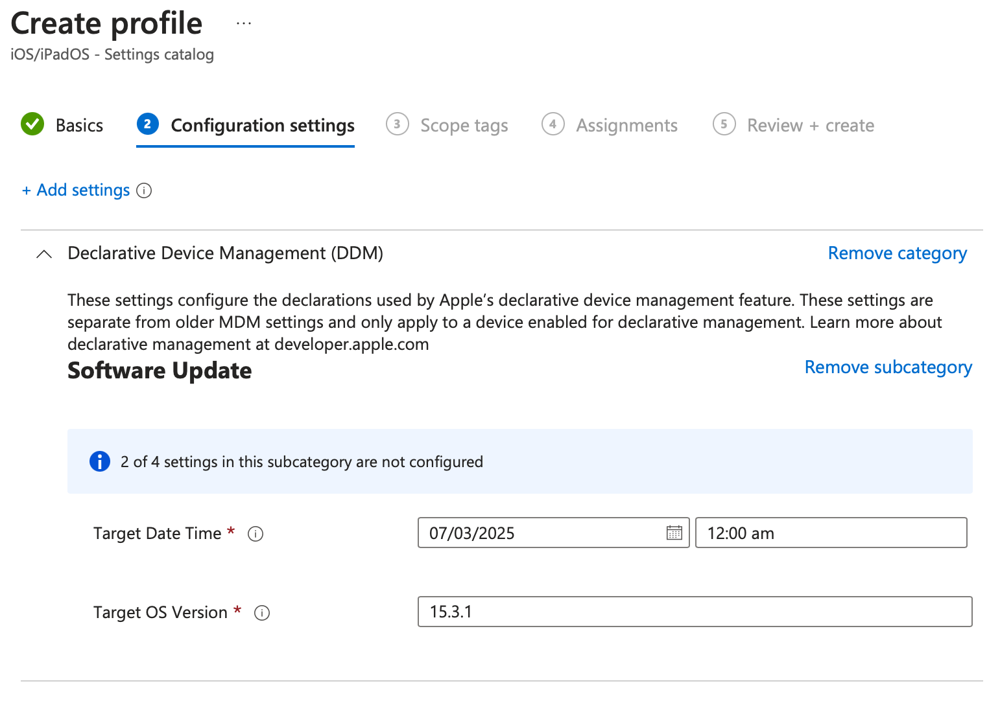
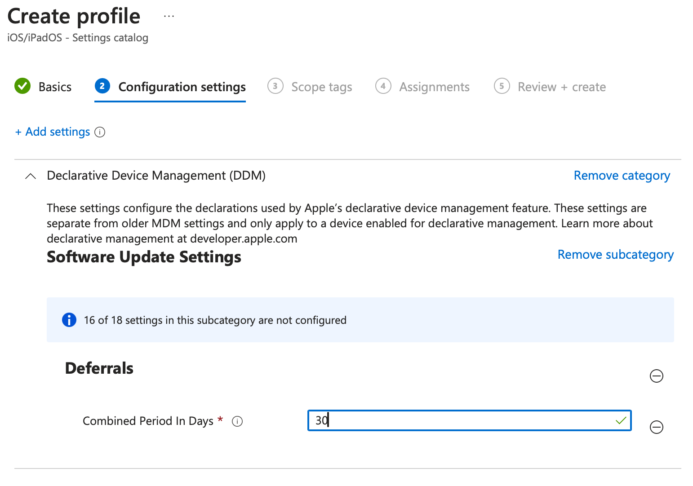
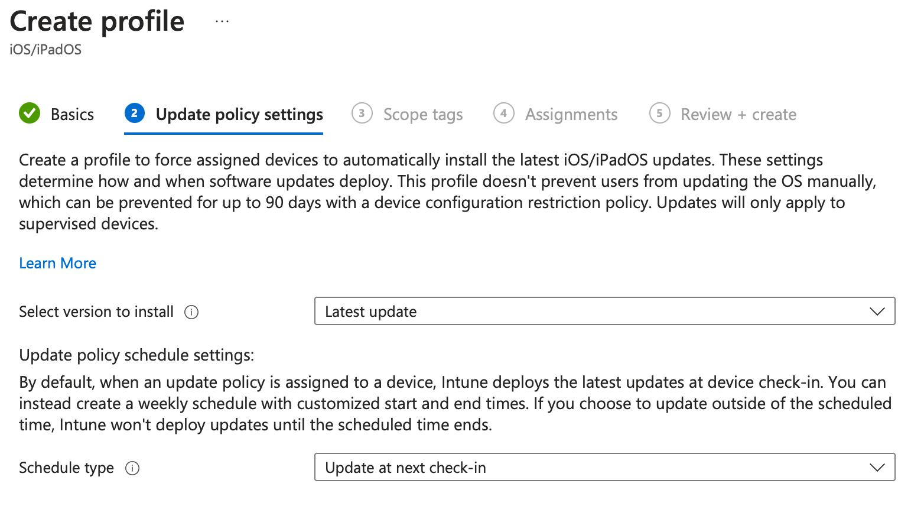
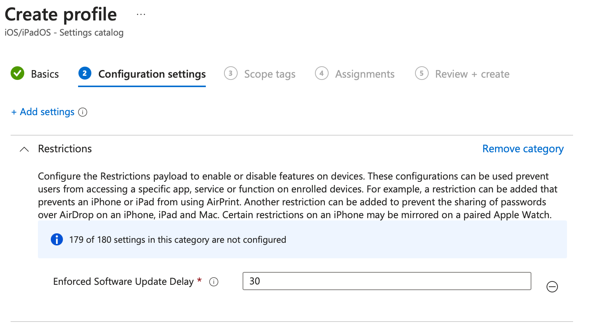

<!-- title: Operating System Updates -->

Managing Operating System Updates
=================================

<!-- @import "[TOC]" {cmd="toc" depthFrom=1 depthTo=2 orderedList=false} -->

<!-- code_chunk_output -->

- [Software Updates using Declaritive Device Management (DDM)](#software-updates-using-declaritive-device-management-ddm)
- [Software Update Deferrals using Declaritive Device Management (DDM)](#software-update-deferrals-using-declaritive-device-management-ddm)
- [Update Methods prior to iOS 17 / macOS 14](#update-methods-prior-to-ios-17--macos-14)
- [Deferal Methods prior to iOS 18 / macOS 15](#deferal-methods-prior-to-ios-18--macos-15)
- [References](#references)

<!-- /code_chunk_output -->

# Software Updates using Declaritive Device Management (DDM)

In the **Intune UI**

Navigate to **Devices -> macOS -> Configuration**

Click **+ Create -> + New Policy**

Choose **Profile Type -> Settings catalog** and click **Create**

Give the profile a name e.g. `Update to Latest OS` then click **Next**

Click **+ Add settings** and select **Declaritive Device Management -> Software Update**

Check **Target Date Time** and **Target OS Version** then close the **Settings Picker**

# Software Update Deferrals using Declaritive Device Management (DDM)

In the **Intune UI**

Navigate to **Devices -> macOS -> Configuration**

Click **+ Create -> + New Policy**

Choose **Profile Type -> Settings catalog** and click **Create**

Give the profile a name e.g. `Defer OS Updates` then click **Next**

Click **+ Add settings** and select **Declaritive Device Management -> Software Update Settings**

Check **Deferrals* and **Combined Period in Days** then close the **Settings Picker**

# Update Methods prior to iOS 17 / macOS 14

_Prior to the implemetation of Declaritive Device Management (DDM) on Apple operating systems updates were managed using a series of MDM commands. This was configured in the Update Policies area of the Intune UI_

In the **Intune UI**

Navigate to **Devices -> iOS/iPadOS -> iOS/iPadOS updates**

Click **+ Create Profile**

Give the profile a name e.g. `iOS Updates` then click **Next**

From the drop down select the appropriate settings for **Select version to install** and **Schedule Type**

# Deferal Methods prior to iOS 18 / macOS 15

Navigate to **Devices -> iOS/iPadOS -> Configuration**

Click **+ Create -> + New Policy**

Click **Profile Type - Settings Catalog** then **Create**

Give the profile a name e.g. `OS Update Deferral` then click **Next**

Click **+ Add settings** and select **Restrictions -> Enforced Software Update Delay** and close the **Settings Picker**

The flow for macOS deferrals is similar

# References
[About software updates for Apple devices](https://support.apple.com/en-au/guide/deployment/depc4c80847a/1/web/1.0)

